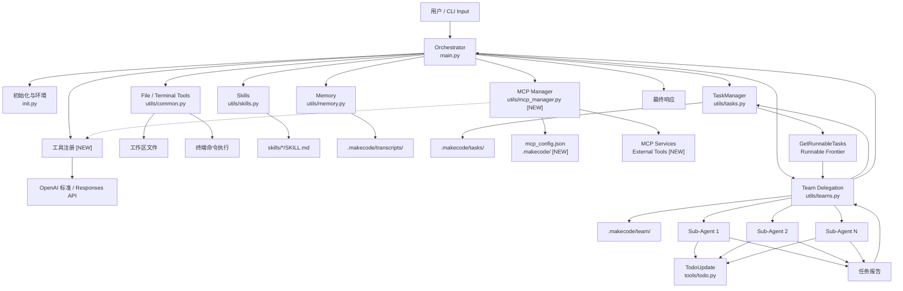

# 🚀 MakeCode · 项目说明

 🌐 语言切换：**简体中文** | [English](README_en.md) | [ 📦 Releases](https://github.com/cockmake/MakeCode/releases)

> 一个多智能体命令行编排器。
> 
> 支持任务拓扑规划、并发子智能体委派、技能加载、文件/终端工具调用，以及长会话压缩。

---

## 1. 项目简介

MakeCode 是一个面向工程任务的 Agent CLI。它采用"编排器（Orchestrator）+ 子智能体（Teammates）"模式：

- 主智能体负责理解需求、规划任务、调度工具、汇总结果。
- TaskManager 负责维护任务依赖关系与可执行前沿。
- Team 系统负责并发唤醒子智能体执行可并行任务，并支持**失败上下文自动恢复**。
- Skills 系统负责按需加载领域技能说明。
- Memory 模块负责在长会话下压缩上下文并保存转录。
- **File Access Control** 模块提供强制读取后编辑、修改时间锁校验与细粒度文件级并发锁。
- **Prompt 集中管理** 将所有 LLM Prompt 统一维护，便于扩展与参数化。

这个项目的目标不是只回答问题，而是让智能体具备**可规划、可执行、可追踪、可扩展**的工程工作流能力。

---

## 🖼️ 效果展示

<table>
<tr>
<td align="center"></td>
<td align="center"></td>
</tr>
<tr>
<td align="center"></td>
<td align="center"></td>
</tr>
<tr>
<td align="center"></td>
<td align="center"></td>
</tr>
</table>

---

## 2. 当前能力

### 2.1 编排器主循环（`main.py`）

- 使用 OpenAI `responses.create(...)` 发起多轮对话。
- 自动处理模型输出的工具调用。
- 聚合以下工具集：
  - File / Terminal 工具
  - Skills 工具
  - Memory 工具
  - TaskManager 工具
  - Team 工具
- 支持 Rich / tqdm / 纯终端三种输出降级显示。
- 启动时展示终端环境，并在上下文过长时触发压缩。

### 2.2 工作目录与环境初始化（`init.py`）

MakeCode 采用严格的工作区（Workspace）隔离机制。所有相对路径、环境变量和技能库加载均以用户当前选择的 **工作目录（WORKDIR）** 为基准，而非 Agent 源码所在目录。

- **环境变量 (`.env`) 加载**：启动时，系统会自动在当前选定的 `WORKDIR` 下寻找 `.env` 文件。如果读取到的环境变量与系统现有的环境变量冲突，CLI 会弹出交互式提示，让用户决定是否覆盖。
- **技能库 (`skills/`) 加载**：系统会严格从 `WORKDIR/skills` 目录中扫描并加载所有的自定义技能（`SKILL.md`）。这样可以确保不同的工程项目可以使用其专属的技能配置，互不干扰。
- 支持交互式选择工作区目录（支持当前目录/自定义目录）。
- **新增** 支持交互式选择底层的接口规范标准：
  - `Chat Completions API`（标准格式，适用于接入大多数开源模型如 DeepSeek、Ollama 等）。
  - `Responses API`（内测定制格式，原生兼容）。
- 初始化 OpenAI 客户端，读取：
  - `OPENAI_API_KEY`
  - `OPENAI_BASE_URL`
  - `MODEL_ID`

### 2.3 文件与终端工具（`utils/common.py`）与文件访问控制（`utils/file_access.py`）

提供以下基础执行能力：

- `RunRead`：读取文件，可指定行号范围。
- `RunWrite`：仅用于新建并写入文件（目标文件不存在时）。
- `RunEdit`：用于修改已存在文件。**支持在一次调用中传入多个不重叠的编辑块（Edit Blocks），并发修改文件的多个位置**（调用前必须先 `RunRead` 确认内容）。
- `RunGrep`：按正则在目标目录内搜索文本文件。
- `RunTerminalCommand`：执行非交互式终端命令。

实现细节：

- 文件访问受工作区边界保护，防止路径逃逸。
- 终端类型在启动时自动检测并固定。
- Windows 优先 `pwsh` / `powershell` / `cmd`，POSIX 优先 `bash` / `zsh` / `sh`。
- 终端命令默认超时为 120 秒。

#### 🔒 文件访问控制机制（新增）

- **强制读取后编辑**：智能体在编辑文件前必须先使用 `RunRead` 读取该文件，否则拦截。
- **修改时间锁校验**：若文件在读取后被其他程序或智能体修改，`RunEdit` 会被拦截并提示重新读取。
- **细粒度文件级锁**：多智能体并发读写时，采用文件级 `RLock` 而非全局锁，提升并发性能。
- **时间戳诊断**：拦截错误信息包含精确的毫秒级 UTC 时间戳（Last modification / Last read），便于排查冲突。
- **事务性依赖回滚**：`UpdateTaskDependencies` 在拓扑校验失败时自动回滚依赖列表，保持数据一致性。
### 2.4 任务管理（`utils/tasks.py`）

TaskManager 提供：

- `CreateTask`
- `UpdateTaskStatus`
- `UpdateTaskDependencies`
- `GetTask`
- `GetRunnableTasks`
- `GetTaskTable`

关键特性：

- 任务状态支持：`pending` / `in_progress` / `completed`
- 活跃任务执行 DAG 校验，避免循环依赖。
- 可执行任务定义为：状态为 `pending` 且所有依赖均已完成。
- 每次运行的任务计划会写入工作区 `.makecode/tasks/`。

### 2.5 并发子智能体（`utils/teams.py`）

Team 模块支持：

- 仅接受来自最新 `GetRunnableTasks` 的任务进行委派。
- 用线程池并发运行多个子智能体。
- 子智能体执行前自动将计划任务置为 `in_progress`。
- 执行完成后回写任务状态。
- 为每个子智能体保存独立 JSONL trace。
- 汇总本轮所有子智能体报告，返回统一报告文本。

运行过程会生成：

- `.makecode/team/task_history_{session_id}.json`
- `.makecode/team/runs/<run_id>/..._trace.jsonl`

#### 🔄 失败上下文恢复（新增）

- 子智能体任务失败后，系统会自动读取该任务的 `trace_log`。
- 失败记录（包括 LLM 输出、工具调用、参数、结果等）会被格式化并注入到重试任务的上下文中。
### 2.6 技能系统（`utils/skills.py`）

支持：

- `LoadSkill`：按精确名称加载某个技能全文
- Skills Catalog 注入：将当前工作区 `skills/` 中可用技能的名称、说明、标签与目录摘要拼接到主智能体和子智能体的 `system prompt` 末尾
- Skills Catalog 开关：

技能存放位置：`skills/<name>/SKILL.md`。工作区启动后，将自定义技能放入该目录即可被自动发现。

默认行为：skills 摘要注入默认开启。关闭后，系统会显示 `skills已关闭`，并停止把技能目录摘要拼接到主/子智能体的 `system prompt` 后面。
### 2.7 会话压缩（`utils/memory.py`）

- 提供 `Compact` 工具用于压缩历史对话。
- 自动保存压缩前转录到 `.makecode/transcripts/`。
- 对工具结果进行轻量清理（`micro_compact`），保留最近结果。
- 调用模型对历史进行摘要后再重建上下文。

### 2.8 Prompt 集中管理（`prompts.py`）（新增）

- 所有 LLM Prompt 统一集中在 `prompts.py` 中管理，便于维护和参数化。
- 包含以下 Prompt 生成函数：
  - `get_orchestrator_system_prompt()`：编排器系统提示
  - `get_sub_agent_system_prompt()`：子智能体系统提示
  - `get_sub_agent_summary_prompt()`：子智能体失败时的摘要提示
  - `get_report_assistant_system_prompt()`：报告助手系统提示
  - `get_summary_system_prompt()` / `get_summary_user_prompt()`：会话压缩提示
  - `get_skill_system_note()`：技能加载时的系统注释

### 2.9 子智能体执行历史加载（新增）

- `/load` 命令支持加载子智能体执行历史（Team Histories）。
- 仅当任务看板成功加载后才提示加载子智能体历史。
- 若任务看板中所有任务已全部完成，则跳过子智能体历史加载询问，避免不必要的交互。
- 历史文件位置：`.makecode/team/task_history_*.json`

### 2.10 子智能体 Todo 工具（`tools/todo.py`）

子智能体内部可使用 `TodoUpdate` 工具维护一个简易待办列表，用于多步骤任务跟踪。
### 2.11 MCP 服务集成（`utils/mcp_manager.py`）🆕

MakeCode 支持通过 **Model Context Protocol (MCP)** 集成外部工具和服务，扩展智能体的能力边界。

#### 核心功能

- **配置驱动加载**：通过 `mcp_config.json` 声明式配置多个 MCP 服务，支持标准协议接入
- **异步生命周期管理**：在后台线程中异步初始化和管理 MCP 客户端，避免阻塞主循环
- **动态服务控制**：支持运行时动态启用/禁用特定 MCP 服务，灵活调整可用工具集
- **统一工具注册**：自动提取 MCP 服务的工具定义，与内置工具统一格式，无缝集成到 `llm_client`
- **错误隔离与恢复**：单个 MCP 服务加载失败不影响其他服务，提供详细的错误日志和降级提示

#### 配置示例

在项目工作区创建 `.makecode/mcp_config.json`：

```json
{
  "mcpServers": {
    "filesystem": {
      "command": "npx",
      "args": ["-y", "@modelcontextprotocol/server-filesystem", "/path/to/workspace"]
    },
    "git": {
      "command": "npx",
      "args": ["-y", "@modelcontextprotocol/server-git"]
    }
  }
}
```

#### 使用流程

1. **配置**：在 `mcp_config.json` 中定义需要集成的 MCP 服务
2. **启动**：MakeCode 初始化时自动加载配置并启动 MCP 客户端
3. **发现**：系统自动提取 MCP 服务的工具列表并注册到工具集
4. **调用**：智能体可通过标准工具调用接口使用 MCP 提供的能力
5. **监控**：通过日志和状态工具查看 MCP 服务运行状态

#### 相关组件

- `utils/mcp_manager.py`：MCP 服务管理器，负责配置加载、客户端管理和工具注册
- `utils/llm_client.py`：统一工具格式提取器，兼容 MCP 原生 Tool 和 pydantic_function_tool
- `main.py`：集成 `GLOBAL_MCP_MANAGER` 到主循环，确保工具集完整可用

> 💡 **提示**：MCP 服务集成是可选功能。如果未配置 `mcp_config.json`，系统将跳过加载并继续正常运行。

## 3. 项目结构与架构

### 3.1 目录结构

```text
Agent/
├─ main.py                  # 编排器主循环与 CLI 交互入口
├─ init.py                  # .env 加载、工作区选择、OpenAI 客户端初始化
├─ prompts.py               # 集中管理所有 LLM Prompt
├─ requirements.txt         # 项目依赖
├─ README.md
├─ README_en.md
├─ tools/
│  └─ todo.py               # 子智能体内部 Todo 管理工具
├─ utils/
│  ├─ llm_client.py         # LLM 标准适配器 (Chat vs Response) 
│  ├─ common.py             # 文件/终端/搜索等基础工具
│  ├─ file_access.py        # 文件访问控制与细粒度并发锁
│  ├─ mcp_manager.py        # MCP 服务管理器，配置加载与工具注册 🆕
│  ├─ tasks.py              # TaskManager 任务拓扑与状态管理
│  ├─ teams.py              # 子智能体并发委派与执行日志
│  ├─ skills.py             # 技能发现与加载
│  └─ memory.py             # 会话压缩与转录保存
├─ skills/
│  ├─ pdf/
│  │  └─ SKILL.md
│  └─ code-review/
│     └─ SKILL.md
└─ build/                   # 打包产物/构建相关文件（若存在）
```

运行中还会生成：

- `.makecode/tasks/`：任务计划 JSON
- `.makecode/team/`：子智能体历史与运行日志
- `.makecode/transcripts/`：压缩前会话转录
### 3.2 架构图（Mermaid）



### 3.3 架构说明

- `main.py` 是总编排器，负责与模型对话、处理工具调用、推进主循环。
- `init.py` 提供工作区选择、环境变量加载与 OpenAI 客户端初始化。
- `prompts.py` 集中管理所有 LLM Prompt，便于维护和参数化。
- `utils/common.py` 提供文件读写、按行编辑、文本搜索和终端命令执行能力。
- `utils/file_access.py` 实现文件访问控制机制：强制读取后编辑、修改时间锁校验、细粒度文件级并发锁。
- `utils/tasks.py` 维护任务 DAG、状态流转与 runnable frontier。
- `utils/teams.py` 负责把最新可执行任务并发委派给子智能体，回收结果，并支持失败上下文恢复。
- `utils/skills.py` 提供技能发现和技能内容加载。
- `utils/memory.py` 负责长会话压缩与转录保存。
- `utils/mcp_manager.py` 🆕 负责 MCP 服务配置加载、客户端生命周期管理、工具提取与注册，支持动态启用/禁用服务。
- `tools/todo.py` 供子智能体在多步骤任务中维护内部待办。
---

## 4. 执行流程

典型流程如下：

1. 用户输入任务。
2. 编排器基于系统策略决定是否先创建或更新 TaskManager 计划。
3. 模型返回工具调用。
4. 编排器执行工具并回填结果。
5. 若存在可并行任务，则先调用 `GetRunnableTasks`。
6. 对最新可执行前沿任务使用 `DelegateTasks` 并发委派。
7. 子智能体完成后回传报告。
8. 编排器继续推进后续任务，直到形成最终答案。

---

## 5. 环境要求

- Python 3.10+
- 可用的 OpenAI 兼容接口
- 模型支持 Chat Completions API 或 Responses API

当前 `requirements.txt` 中声明的依赖：

- `openai`
- `pydantic`
- `prompt_toolkit`
- `python-dotenv`
- `rich`
- `tqdm`

---

## 6. 安装与运行

### 6.1 安装依赖

```bash
pip install -r requirements.txt
```

### 6.2 准备工作区（重要）

MakeCode 采用严格的工作区（Workspace）隔离机制，因此**不建议**在 MakeCode 源码目录直接运行任务。请在你实际要处理的项目目录（即你希望 Agent 工作的目录）中，准备以下内容：

1. **环境配置文件 `.env`**：
   在你的目标工作区根目录下创建 `.env` 文件，填入模型配置：
   ```env
   OPENAI_BASE_URL=your_endpoint
   OPENAI_API_KEY=your_api_key
   MODEL_ID=your_model_id
   ```
   > 注：`MODEL_ID` 对应的模型必须支持 Chat Completions API 或 Responses API。当该文件中的变量与系统环境变量冲突时，启动 MakeCode 时会弹出交互式提示让你选择是否覆盖。

2. **自定义技能库 `skills/`（可选）**：
   如果你的项目需要特定的专家技能，请在你的目标工作区根目录下创建一个 `skills` 文件夹。
   目录结构如：`skills/<skill-name>/SKILL.md`。MakeCode 会严格仅从该目录下加载技能。

### 6.3 启动

在 MakeCode 的源码目录下运行以下命令启动 CLI：

```bash
python main.py
```

启动后会进入向导流程：
1. **交互式选择工作区目录（WORKDIR）**：输入你刚才准备好 `.env` 和 `skills` 的所在目录（绝对路径），或者按回车使用当前目录。
2. **处理环境变量冲突**：如果 `.env` 文件变量与系统变量有冲突，按提示进行覆盖确认。
3. **选择 API 标准**：选择你使用的底层 API 协议（Chat Completions API 或 Responses API）。
4. **进入交互式终端**：开始与主代理对话。

### 6.4 内置快捷命令（Slash Commands）

在交互式 CLI 中，支持输入斜杠 `/` 来触发快捷命令（带有输入补全提示）：

| 命令 | 描述 |
| --- | --- |
| `/cmds` | 列出所有的可用命令和功能描述 |
| `/mcp-view` | 查看 MCP 状态总览，以及当前已加载的 MCP 工具列表 |
| `/mcp-restart` | 重新启动 MCP 后台管理器并重新加载配置 |
| `/mcp-switch` | 交互式切换 MCP 服务启用/禁用状态，确认后保存到 `.makecode/mcp_config.json` 并尝试增量启停 |
| `/load` | 列出历史 checkpoint 并选择加载 |
| `/skills-switch` | 切换 skills 目录摘要注入状态 (开启/关闭) |
| `/skills-list` | 列出当前工作区可用的 skills |
| `/compact` | 压缩当前对话上下文 |
| `/tools` | 列出当前可用工具详细信息 |
| `/tasks` / `/plan` | 查看任务看板和当前执行进度 |
| `/status` | 汇报系统状态、已完成任务和下一步计划 |
| `/help` | 显示使用帮助和自我介绍 |
| `/workspace` / `/ls` | 查看当前工作区目录结构 |
| `/clear` / `/reset` | 清空当前对话历史 |
| `/quit` / `/exit` | 退出程序 |

> 💡 **提示：MCP 相关命令说明**
> - `/mcp-view`：先展示 MCP 状态总览，包括“配置中的服务 / 配置中已启用 / 配置中已禁用 / 当前已加载服务”，再展示当前已加载工具明细。
> - `/mcp-restart`：强制重启 MCP 后台管理器，重新读取 `.makecode/mcp_config.json` 并初始化服务。
> - `/mcp-switch`：打开交互式开关面板，使用 `↑/↓` 选择服务，`Space` 切换草稿状态，底部可选择“确认保存并应用变更”或“取消，不保存本次修改”。确认后会先写回配置文件，再按变更尝试对单个服务做增量启用/停用；取消则不会保存也不会改动当前运行状态。
---

## 7. 使用约束

项目当前内置的重要规则包括：

- 优先使用 File 工具进行文件读写与文本搜索。
- 常规文件操作不应依赖终端命令完成。
- 委派前必须先调用 `GetRunnableTasks`。
- `DelegateTasks` 只允许处理最新可执行前沿中的任务。
- 仅适合并行且彼此独立的任务才能并发委派。
- 终端命令必须是非交互式、安全的命令。

---

## 8. 扩展方式

### 8.1 新增技能

1. 新建目录 `skills/<name>/`
2. 添加 `SKILL.md`
3. 可在 frontmatter 中声明：
   - `name`
   - `description`
   - `tags`
4. 新技能会在后续构建 system prompt 时自动被扫描并汇总到 Skills Catalog 中；如需临时关闭摘要注入，可使用 `/skills-switch` 进行切换
5. 当任务确实需要该技能全文时，智能体可直接调用 `LoadSkill`

### 8.2 新增工具

当前工具注册方式统一基于 `openai.pydantic_function_tool(...)`。系统在底层（`utils/llm_client.py`）会自动将其格式化处理为适配不同大模型 API 标准的格式。

新增工具的一般步骤：

1. 定义 Pydantic 模型作为工具入参描述
2. 实现具体的 Python 函数处理逻辑
3. 通过 `pydantic_function_tool` 注册到对应工具集合列表
4. 将该工具的方法名与对应的函数绑定到 `*_HANDLERS` 字典中
5. 在主循环或子智能体循环的工具聚合列表中接入

---
---

## 9. 常见问题

### 9.1 缺少环境变量

如果启动时报错，请检查：

- `OPENAI_API_KEY`
- `OPENAI_BASE_URL`
- `MODEL_ID`

### 9.2 路径越界

`RunRead` / `RunWrite` / `RunEdit` / `RunGrep` 都以工作区为边界，超出工作区的路径会被拒绝。

### 9.3 终端命令失败

请确认：

- 本机存在启动时检测到的终端环境
- 命令不需要交互输入
- 命令未超过 120 秒超时限制

### 9.4 为什么委派任务失败

常见原因：

- 任务不在最新 `GetRunnableTasks` 返回结果中
- 任务存在依赖未完成
- 传入了重复或不存在的任务 ID
