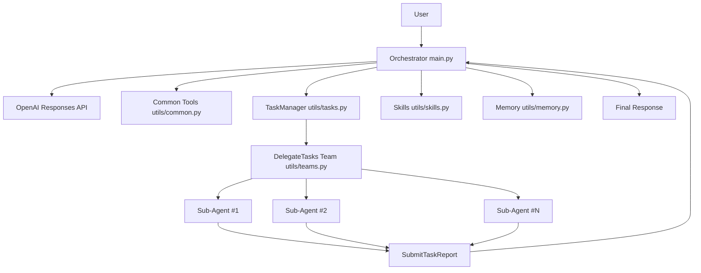

# 🚀 MakeCode · 项目说明文档

🌐 语言切换：**简体中文** | [English](README_en.md)

> ✅ 当前支持 **OpenAI Response API**。

**MakeCode 是一个多代理协同命令行助手：** 支持任务拓扑管理、并发子代理委派、技能动态加载、文件/终端工具调用，以及会话上下文压缩，适合复杂工程任务的拆解与执行。

---

## 📌 1. 项目定位

MakeCode 采用“编排器（Orchestrator）+ 子代理（Teammates）”协作模型：

- 🧠 主代理负责理解用户需求、规划任务、调用工具、统筹执行。
- 👥 子代理按角色并发处理可并行任务，并回传结构化报告。
- 🕸️ 系统通过 TaskManager 维护依赖关系，保障执行顺序与一致性。

目标是让代理不仅“能回答”，还能“能落地执行、可追踪、可扩展”。

---

## ✨ 2. 核心能力

### 🧠 2.1 编排器主循环（`main.py`）

- 维护多轮对话历史并持续调用模型。
- 自动处理模型发起的 `function_call`。
- 支持 Rich / tqdm / 原生终端输出渲染。
- 超长上下文触发轻量压缩（`micro_compact`）。

### 🧰 2.2 工具系统（`utils/common.py`）

统一注册与处理工具，核心能力包括：

- `RunRead`：读取文件（支持行号范围）
- `RunWrite`：写入文件（自动创建目录）
- `RunEdit`：按行替换文件内容
- `RunTerminalCommand`：执行非交互终端命令

并自动检测可用终端（Windows 优先 `pwsh` / `powershell` / `cmd`）。

### 🗂️ 2.3 任务拓扑管理（`utils/tasks.py`）

TaskManager 生命周期接口：

- `CreateTask`
- `UpdateTaskStatus`
- `UpdateTaskDependencies`
- `GetTask`
- `GetRunnableTasks`
- `GetTaskTable`

关键特性：

- 内置 DAG 校验，防循环依赖。
- 可执行任务定义：`pending` 且所有依赖均 `completed`。
- 任务计划持久化到 `.tasks/`。

### 👥 2.4 团队并发委派（`utils/teams.py`）

- `DelegateTasks` 仅允许委派最新可执行前沿任务。
- 线程池并发执行多个子代理。
- 每个子代理拥有独立 JSONL trace 日志。
- 完成后回写 TaskManager 状态并自动汇总报告。

### 🧩 2.5 技能加载系统（`utils/skills.py` + `skills/*`）

- `ListSkills`：列出可用技能
- `LoadSkill`：加载技能正文

内置示例技能：

- `pdf`
- `code-review`

### 🧠 2.6 会话记忆压缩（`utils/memory.py`）

- 转录原始历史到 `.transcripts/`
- 调用模型总结并压缩历史上下文
- 保留系统消息与当前轮关键信息

---

## 🏗️ 3. 架构图说明

### 架构总览（Mermaid）



### 模块交互解读

- `main.py` 是入口与总调度中心，负责模型调用与工具回路执行。
- `utils/tasks.py` 维护任务依赖与可执行前沿，控制并发边界。
- `utils/teams.py` 将可并行任务下发给子代理并收集报告。
- `utils/common.py` / `utils/skills.py` / `utils/memory.py` 分别提供基础执行能力、技能扩展、上下文治理。

### 📸 实际演示（过程与结果）

以下示例图展示了从执行过程到最终成果的完整链路：

**过程 1（先行展示）**

<p align="center">
  
</p>

**其余过程与结果（2x2）**

| 过程 2 | 过程 3 |
| --- | --- |
|  |  |
|  |  |

---

## 📁 4. 目录结构

```text
Agent/
├─ main.py                  # 程序入口：编排器主循环与交互界面
├─ init.py                  # 工作目录初始化、环境变量加载、OpenAI 客户端初始化
├─ requirements.txt         # Python 依赖
├─ tools/
│  └─ todo.py               # 子代理内部 Todo 跟踪工具
├─ utils/
│  ├─ common.py             # 通用工具定义与终端命令执行
│  ├─ tasks.py              # TaskManager（任务拓扑与状态）
│  ├─ teams.py              # 并发子代理委派与日志管理
│  ├─ skills.py             # 技能发现与加载
│  └─ memory.py             # 上下文压缩与转录保存
└─ skills/
   ├─ pdf/SKILL.md
   └─ code-review/SKILL.md
```

运行过程自动生成：

- `.tasks/`：任务计划 JSON
- `.team/`：子代理历史与并发日志
- `.transcripts/`：压缩前会话转录

---

## ⚙️ 5. 环境要求

- Python 3.10+（建议 3.11/3.12）
- 可访问的 OpenAI 兼容接口

---

## 🚀 6. 安装与启动

### 安装依赖

```bash
pip install -r requirements.txt
```

### 配置环境变量（`.env`）

```env
OPENAI_BASE_URL=your_endpoint
OPENAI_API_KEY=your_api_key
MODEL_ID=your_model_id
```

### 启动

```bash
python main.py
```

启动后支持交互式工作目录选择，并进入多轮 CLI 交互。

---

## 🔄 7. 端到端执行流程

1. 用户输入需求
2. 编排器请求模型生成下一步动作
3. 执行工具调用并回填结果
4. 必要时通过 TaskManager 管理依赖
5. 对可并行任务使用 Team 委派子代理
6. 子代理回传 `SubmitTaskReport`
7. 编排器汇总并输出最终答案

---

## 🧱 8. 关键约束

- 文件读写优先 File 工具，不鼓励 shell 做常规文件操作。
- 并发委派前必须先 `GetRunnableTasks`。
- TaskManager 对活跃任务执行 DAG 校验。
- 终端命令为非交互模式，默认超时 120 秒。

---

## 🩺 9. 常见问题

### 9.1 缺少环境变量

请确认：

- `OPENAI_BASE_URL`
- `OPENAI_API_KEY`
- `MODEL_ID`

### 9.2 文件路径越界

`RunRead/RunWrite/RunEdit` 有工作区边界保护，请使用工作区内相对路径。

### 9.3 终端输出乱码

命令输出优先 UTF-8 解码，失败后回退系统编码（Windows 常见 GBK）。

### 9.4 任务不可委派

请检查任务是否在最新 `GetRunnableTasks` 返回列表中。

---

## 🛠️ 10. 扩展指南

### 新增技能

1. 创建 `skills/<name>/SKILL.md`
2. 在 frontmatter 声明 `name`、`description`（可选 `tags`）
3. 重启后可被 `ListSkills` / `LoadSkill` 发现

### 新增工具

1. 定义 Pydantic 工具模型与处理函数
2. 使用 `make_response_tool(pydantic_function_tool(...))` 注册
3. 合并到 `SUPER_TOOLS` 与 `SUPER_TOOLS_HANDLERS`

---

## 📦 11. 依赖清单

- `openai`
- `pydantic`
- `prompt_toolkit`
- `python-dotenv`
- `rich`
- `tqdm`

---

## 📄 12. 许可

当前仓库未显式提供 License。  
如需开源发布，建议补充 `LICENSE` 与 `CONTRIBUTING`。

