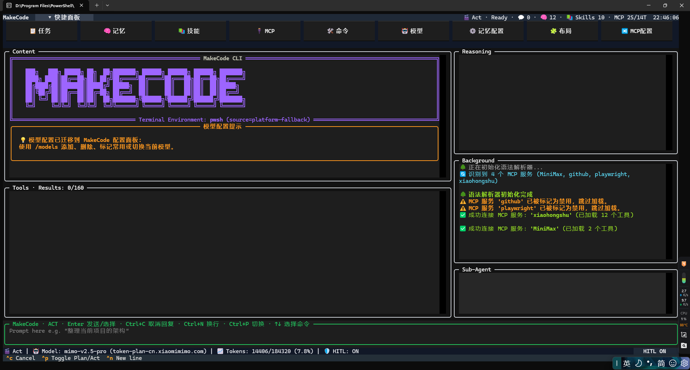
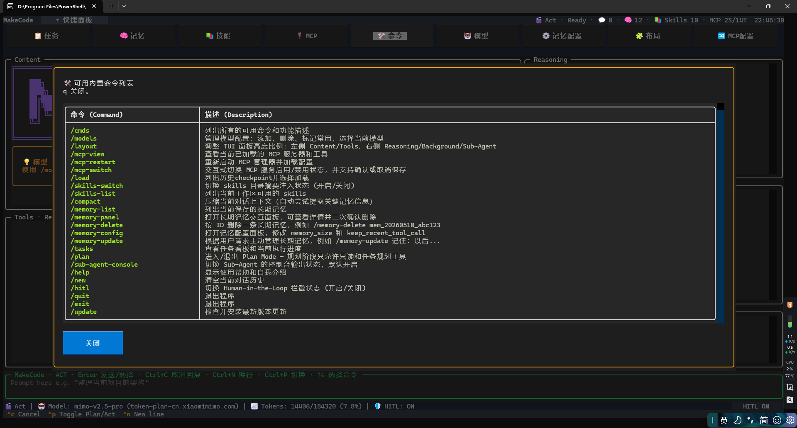
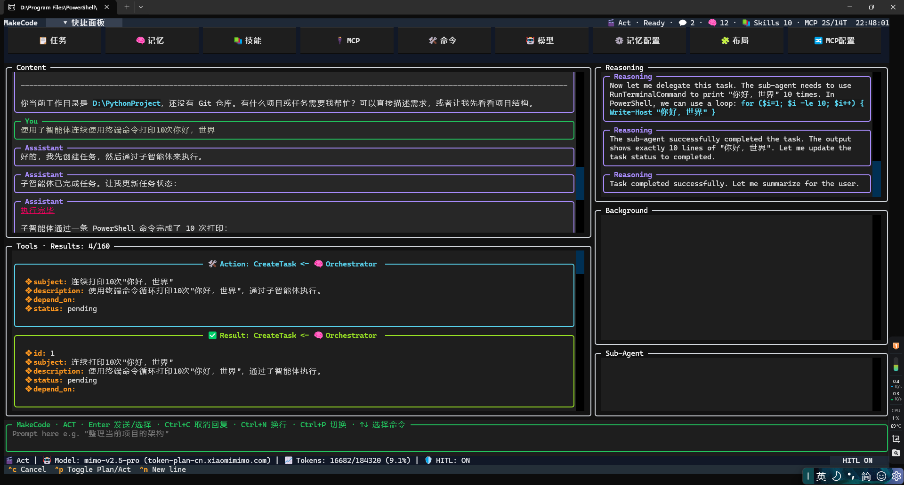
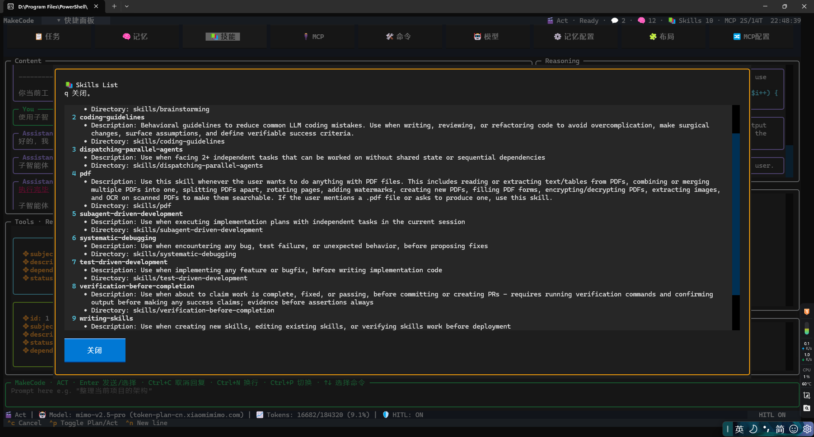
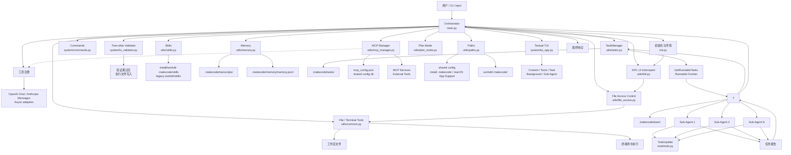

# 🚀 MakeCode · 项目说明

🌐 语言切换：**简体中文** | [English](README_en.md) | [📦 Releases](https://github.com/upupmake/MakeCode/releases)

> 一个多智能体命令行编排器。
>
> 支持任务拓扑规划、并发子智能体委派、技能加载、文件/终端工具调用，以及长会话压缩。

---

## 1. 项目简介

MakeCode 是一个面向工程任务的 Agent CLI。它采用"编排器（Orchestrator）+ 子智能体（Teammates）"模式：

- 主智能体负责理解需求、规划任务、调度工具、汇总结果。
- TaskManager 负责维护任务依赖关系与可执行前沿。
- Team 系统负责并发唤醒子智能体执行可并行任务，并支持**失败上下文自动恢复**。
- Skills 系统负责按需加载领域技能说明。
- Memory 模块负责长会话压缩、长期记忆管理与转录保存，并在每次主请求前自动进行**长期记忆召回（Pre-Recall）**。
- **File Access Control** 模块提供强制读取后编辑、修改时间锁校验与细粒度文件级并发锁。
- **Prompt 集中管理** 将所有 LLM Prompt 统一维护，便于扩展与参数化。
- **集中路径模块（`utils/paths.py`）** 统一管理工作区目录与安装目录派生路径，所有模块统一通过共享 getter 访问 `.makecode/` 子目录。
- **跨平台打包支持** 提供 Windows X64、macOS ARM64 与 Linux X64 发布包；macOS 通过顶层 `MakeCode.command` 启动，Linux 直接运行 `MakeCode/MakeCode`。
- **Textual 多区 TUI** 将主智能体输出分发到 `Content / Tools / Task / Background / Sub-Agent / Status` 等独立面板，并支持自定义面板比例。

这个项目的目标不是只回答问题，而是让智能体具备**可规划、可执行、可追踪、可扩展**的工程工作流能力。

---

## 🖼️ 效果展示

<table>
<tr>
<td align="center"></td>
<td align="center"></td>
</tr>
<tr>
<td align="center"></td>
<td align="center"></td>
</tr>
</table>

---

## 2. 当前能力

### 2.1 编排器主循环（`main.py`）

- 使用 OpenAI Chat Completions 或 Anthropic Messages 协议发起多轮对话。
- 自动处理模型输出的工具调用。
- 聚合以下工具集：
    - File / Terminal 工具
    - Skills 工具
    - Memory 工具
    - TaskManager 工具
    - Team 工具
- 支持 Rich / tqdm / 纯终端三种输出降级显示。
- 启动时展示终端环境，并在上下文过长时触发压缩。

### 2.2 工作目录与环境初始化（`init.py`）

MakeCode 采用严格的工作区（Workspace）隔离机制。所有路径和技能库加载均以用户当前选择的 **工作目录（WORKDIR）**
为基准，而非 Agent 源码所在目录。

- **技能库 (`skills/`) 加载**：系统会严格从 `WORKDIR/skills` 目录中扫描并加载所有的自定义技能（`SKILL.md`
  ）。这样可以确保不同的工程项目可以使用其专属的技能配置，互不干扰。
- 启动时以 **Textual TUI 向导面板** 交互式选择工作区目录（当前目录或自定义路径），不再依赖任何环境变量（如历史上的 `MAKECODE_WORKDIR` 已移除）。
- 支持按模型配置选择消息格式：
    - `openai_chat`（OpenAI Chat Completions 消息格式）
    - `anthropic`（Anthropic Messages 协议）
- **路径集中管理**：工作区路径、安装目录路径、`.makecode/` 子目录（`tasks/`、`team/`、`memory/`、`transcripts/`、`checkpoint/`等）及安装目录下的 `model_config.json`、`mcp_config.json`、`layout_config.json`、`error.log` 均由 `utils/paths.py` 统一提供。
- **模型配置**：通过内置的 `/models` 命令进行管理（详见 2.15 节）

### 2.3 文件与终端工具（`utils/common.py`）与文件访问控制（`utils/file_access.py`）

提供以下基础执行能力：

- `FileRead`：读取文件，可指定行号范围。
- `FileCreate`：仅用于新建并写入文件（目标文件不存在或为空时）。**写入前自动触发 Tree-sitter 语法验证**，若检测到语法错误会拦截并显示详细报错行号。
- `FileEdit`：用于修改已存在文件。**使用文本搜索替换机制（search_content → replace_content），而非行号范围**。需先 `FileRead` 确认内容，通过提供包含上下文的精确文本来定位修改位置。**支持三重容错：精确匹配 → Strip匹配 → Difflib模糊匹配（相似度≥90%）**。编辑后自动触发 Tree-sitter 语法验证。
- `ContentSearch`：通过 `content_regex` 在 `search_dir` 内搜索文本文件内容，并可用 `filename_regex` 按文件绝对路径正则过滤；正则使用 Python 语法。自动排除常见构建/依赖目录（`build`、`dist`、`__pycache__`、`node_modules`、`target`、`venv`、`site-packages`、`htmlcov`）和 `.` 开头的隐藏目录，减少无关匹配。
- `FileSearch`：通过 `path_regex` 按文件/目录绝对路径正则搜索，正则使用 Python 语法，支持类型过滤（`file`/`dir`/`all`）。自动排除隐藏目录和构建/依赖目录，最多返回 500 条结果。适合快速探索项目结构。
- `RunTerminalCommand`：执行非交互式终端命令。

#### 📋 Tree-sitter 语法验证（`system/ts_validator.py`）

`FileCreate` 和 `FileEdit` 在写入文件前会自动调用 Tree-sitter 进行语法校验：

- **多语言支持**：自动检测 Python、JavaScript、TypeScript、Go、Rust 等多种编程语言
- **智能排除**：自动跳过纯文本和文档文件（`.md`、`.txt`、`.rst`、`.log` 等），避免误报
- **详细报错**：若检测到语法错误，拦截写入并显示精确的行号和列号，最多展示前 5 个核心错误
- **Fail-Open 策略**：找不到语言解析器、环境异常或无法判断语言时静默放行，不阻塞正常操作

实现细节：

- 文件访问受工作区边界保护，防止路径逃逸。

### 2.4 文件访问控制机制（`utils/file_access.py`）

- **强制读取后编辑**：智能体在编辑文件前必须先使用 `FileRead` 读取该文件，否则拦截。
- **修改时间锁校验**：若文件在读取后被其他程序或智能体修改，`FileEdit` 会被拦截并提示重新读取。
- **细粒度文件级锁**：多智能体并发读写时，采用文件级 `RLock` 而非全局锁，提升并发性能。
- **时间戳诊断**：拦截错误信息包含精确的毫秒级 UTC 时间戳（Last modification / Last read），便于排查冲突。
- **事务性依赖回滚**：`UpdateTasksDependencies` 在拓扑校验失败时自动回滚整个更新批次，保持数据一致性。

### 2.5 高危操作人工拦截（HITL）机制

为保障 Agent 在真实工程环境下的执行安全，系统引入了 Human-In-The-Loop (HITL) 拦截机制：

- **敏感操作拦截**：默认拦截修改类文件操作（`FileEdit`、`FileCreate`）与关键基础终端命令（如 `npm`, `git`、`rm` 等，通过白名单外放行策略）。
- **TUI 交互面板**：基于 `Textual` 实现的终端可视化拦截面板，支持使用方向键选择“允许执行”或“拒绝并附加反馈”。
- **并发安全排队**：在多子智能体并发执行时，底层通过 `ContextVar` 跨协程/线程边界追踪触发拦截的智能体身份（如
  `0:Orchestrator` 或 `1:Frontend Developer`），并利用全局 `threading.Lock` 实现请求的安全排队渲染，防止 UI 错乱。
- **沙盒逃逸防护**：全面捕获拦截面板中的 `Ctrl+C` (`KeyboardInterrupt`) 和 `EOFError`
  。当用户在交互中强行中断时，系统不会导致子智能体崩溃死亡，而是将中断转化为带有拒因的字符串反馈给大模型，让智能体按规则自我修正。
- **工作区外路径访问拦截与目录白名单**：当工具访问工作区外的路径时，HITL 会拦截并提供三个选项：(1) 允许本次访问；(2) 允许整个目录（含子目录）在整个会话期间免确认；(3) 拒绝。选择目录白名单后，后续对该目录下所有子路径的访问将自动放行，白名单在切换 HITL 状态、`/new` 时清空。

### 2.6 任务管理（`utils/tasks.py`）

TaskManager 提供：

- `CreateTasks`（通过列表批量创建任务）
- `UpdateTasksStatus`（通过列表批量更新任务状态）
- `UpdateTasksDependencies`（通过列表原子更新任务依赖）
- `UpdateTasksContent`（通过列表批量更新任务标题和描述）
- `DeleteAllTasks`（带强制安全确认）
- `GetRunnableTasks`
- `GetTaskTable`

关键特性：

- 任务状态支持：`pending` / `completed`
- 批量创建、内容更新、状态更新和依赖更新会先校验完整批次，失败时不会保留部分修改。
- 活跃任务执行 DAG 校验，批量依赖更新产生环时回滚整个批次。
- 可执行任务定义为：状态为 `pending` 且所有依赖均已完成。
- 每次运行的任务计划会写入工作区 `.makecode/tasks/`。
- `/tasks` 保留完整任务表格视图，并支持选中任务后按 `d` 发起删除、再按 `y`/`n` 确认或取消；删除任务时会同步移除其他任务对该任务的依赖引用。
- `DeleteAllTasks` 提供了一键清空重置任务拓扑的能力，方便在复杂场景下推翻重来。

### 2.7 并发子智能体（`utils/teams.py`）

Team 模块支持：

- 仅接受来自最新 `GetRunnableTasks` 的任务进行委派。
- 用线程池并发运行多个子智能体。
- 执行完成后由编排器通过 `UpdateTasksStatus` 回写任务状态。
- 为每个子智能体保存独立 JSONL trace。
- 汇总本轮所有子智能体报告，返回统一报告文本。

运行过程会生成：

- `.makecode/team/task_history_{session_id}.json`
- `.makecode/team/runs/<run_id>/..._trace.jsonl`

#### 🔄 失败上下文恢复（新增）

- 子智能体任务失败后，系统会自动读取该任务的 `trace_log`。
- 失败记录（包括 LLM 输出、工具调用、参数、结果等）会被格式化并注入到重试任务的上下文中。

### 2.8 技能系统（`utils/skills.py`）

支持：

- `LoadSkill`：按精确名称加载某个技能全文
- Skills Catalog 注入：将安装目录与工作区技能源中可用技能的名称、说明、标签与绝对目录摘要拼接到主智能体和子智能体的
  `system prompt` 末尾
- Skills Catalog 开关：

技能按以下优先级从三个目录加载（同名技能由高优先级目录覆盖）：

1. 安装目录 `install_dir/.makecode/skills/<name>/SKILL.md`（内置技能）
2. 工作区 `workdir/.makecode/skills/<name>/SKILL.md`（用户技能的默认安装位置）
3. 工作区旧路径 `workdir/skills/<name>/SKILL.md`（向后兼容）

工作区启动后，将自定义技能放入 `workdir/.makecode/skills/` 即可被自动发现。`SKILL.md` 的 frontmatter 必须包含有效的 `name` 与 `description` 才会被加载。

默认行为：skills 摘要注入默认开启。关闭后，系统会显示 `skills已关闭`，并停止把技能目录摘要拼接到主/子智能体的`system prompt`
后面。

### 2.9 会话压缩与长期记忆（`utils/memory.py`）

- 提供 `Compact` 工具用于压缩历史对话。
- 自动保存压缩前转录到 `.makecode/transcripts/`。
- 对工具结果进行轻量清理（`micro_compact`），保留最近结果。
- 调用模型对历史进行摘要后再重建上下文。
- 在压缩完成后自动分析是否需要写入、更新或删除**长期记忆**，将可跨会话复用的稳定信息注入后续 Prompt。
- 长期记忆同时支持**主动管理模式**：用户可显式发起记忆维护请求，而不必等待自动压缩流程触发。
- **请求前自动召回（Pre-Recall）**：每次主请求开始前，编排器会先以当前用户输入为查询，调用 `RecallLongTermMemory` 检索相关长期记忆，并作为处理上下文注入到对话中；编排器还可主动调用 `RememberLongTermMemory` 请求记忆管理器更新长期记忆。
- **TUI Background 区渲染**：记忆召回与写入活动会在独立的 `Background` 面板中实时展示，不污染主对话区。
- **Plan Mode 隔离**：`RememberLongTermMemory` 在 Plan Mode 下被拦截，防止规划阶段写入记忆；读取类动作不受影响。

#### 长期记忆管理机制

- **三类记忆动作**：支持新增、更新、删除长期记忆，而不是只追加记录。
- **双模式管理**：
    - `compact`：在上下文压缩后，基于摘要、转录和当前 active 记忆自动判断是否需要变更长期记忆。
    - `active`：当用户显式发起记忆管理请求时，以用户明确请求为主要依据，并仅将当前非 system 对话转录作为辅助证据。
- **Memory Agent 工具循环**：记忆智能体以有界工具循环运行，最多执行 5 轮；只负责长期记忆管理，不与用户交互、不追问澄清，也不继续执行原始任务。
- **证据数据边界**：`reason`、`summary`、当前记忆和对话转录只作为记忆决策证据处理；即使转录中包含嵌入指令，也不会被当作需要执行的指令。
- **筛选原则**：仅保存对未来会话有复用价值的稳定信息，例如用户偏好、项目约定、工作流规则、常见陷阱和已确认的发布规范；不保存一次性任务进度、临时实现细节或可直接从仓库重新读取的事实。
- **决策消息生成**：当摘要为空时，记忆决策消息会省略 Summary 段落，而不是渲染空的 Summary 区块。
- **容量与淘汰策略**：长期记忆容量可配置；超出上限时，系统会按时间顺序淘汰较旧的 active 记忆。
- **存储位置**：长期记忆保存于 `.makecode/memory/memory.jsonl`，记忆配置保存于 `.makecode/memory/memory_config.json`。
- **容错读取**：读取记忆 JSONL 时会跳过无效行，并保持原文件内容不被重写。
- **渲染顺序**：长期记忆渲染与 `/memory-panel` 面板均按 `updated_at` 升序排列（缺失时回退 `created_at`），只影响展示层，不改变 JSONL 存储顺序和增删改查逻辑。

#### 长期记忆命令

- `/memory-list`：列出当前 active 长期记忆。
- `/memory-panel`：打开长期记忆面板，可查看/复制/管理记忆。
- `/memory-delete`：按 ID 删除一条或多条长期记忆。
- `/memory-config`：打开记忆配置面板，可修改 `memory_size` 和 `keep_recent_tool_call`。
- `/memory-update [prompt]`：根据用户提供的请求主动新增、修正或清理长期记忆；prompt 可选，省略时基于当前转录自动推断。

#### 流式摘要生成

- **实时流式显示**：使用 Rich Live 组件实时显示摘要生成过程，用户可直观看到进度
- **异步流式摘要生成**：底层通过统一的异步 `generate_stream()` adapter 生成摘要，并按模型配置选择 OpenAI Chat 或 Anthropic Messages；失败时保留异步回退路径。
- **上下文压缩显示优化**：改进后的 UI 在压缩过程中提供更友好的进度反馈

### 2.10 Prompt 集中管理（`prompts.py`）（新增）

- **统一 Prompt 文件**：所有 LLM 的系统提示词、摘要提示和用户引导等文本统一维护于 `prompts.py` 中。
- **HITL 防御认知植入**：内置关于拦截失败后的特殊系统提示（Sub-Agent 和
  Orchestrator），教育大模型了解“人工介入”（Human-In-The-Loop）拒绝请求的原因，让大模型自主修复而非无限重试。
- 包含以下 Prompt 生成函数：
    - `get_orchestrator_system_prompt()`：编排器系统提示
    - `get_sub_agent_system_prompt()`：子智能体系统提示
    - `get_sub_agent_summary_prompt()`：子智能体失败时的摘要提示
    - `get_report_assistant_system_prompt()`：报告助手系统提示
    - `get_summary_system_prompt()` / `get_summary_user_prompt()`：会话压缩提示
    - `get_skill_system_note()`：技能加载时的系统注释

### 2.11 会话记录与历史加载 (`/load`)

- `/load` 命令支持从 Checkpoint 恢复任意历史会话，包括主智能体对话链路与子智能体执行历史。
- **全量 UI 重绘**：加载历史记录后，系统会自动清屏（`console.clear()`）并按照最新终端 UI 样式重新渲染每一条消息（包括 User
  输入、AI 文本、Tool 调用意图及 Tool 执行结果）。
- **配置防污染**：在加载历史 Checkpoint 时，系统会自动同步最新的 System Prompt 和全局配置（如当前日期、MCP/Skills
  开关状态），防止被旧数据覆盖。
- Checkpoint 选择列表支持选中后按 `d` 发起删除、再按 `y`/`n` 确认或取消；若删除的是当前绑定 Checkpoint，会同步清空绑定，避免后续保存重新创建已删除文件。
- 对于子智能体历史，仅当任务看板成功加载后才提示加载。若任务看板中所有任务已全部完成，则自动跳过询问。

### 2.12 会话标题自动生成

MakeCode 会在用户首次提问后，自动基于查询内容生成简短的会话标题，并将其嵌入到相关文件名中，方便会话识别与管理：

- **自动标题生成**：使用 LLM 根据用户首次查询，自动生成简短且有意义的会话标题
- **文件名关联**：生成的标题会自动同步到以下文件的文件名中：
    - 检查点文件：`ckpt_{title}_{timestamp}_{uid}.json`
    - 任务计划文件：`task_plan_{title}_{epic_id}.json`
    - 任务历史文件：`task_history_{title}_{session_id}.json`
- **标题安全处理**：通过 `sanitize_title()` 确保标题仅包含文件名安全字符，不影响文件系统
- **懒加载工具绑定**：工具处理器采用延迟解析模式，确保标题变更后工具调用自动指向最新实例

### 2.13 子智能体 Todo 工具（`tools/todo.py`）

子智能体内部可使用 `TodoUpdate` 工具维护一个简易待办列表，用于多步骤任务跟踪。

### 2.14 MCP 服务集成（`utils/mcp_manager.py`）

MakeCode 支持通过 **Model Context Protocol (MCP)** 集成外部工具和服务，扩展智能体的能力边界。

#### 核心功能

- **配置驱动加载**：通过 `mcp_config.json` 声明式配置多个 MCP 服务，支持标准协议接入
- **异步生命周期管理**：在后台线程中异步初始化和管理 MCP 客户端，避免阻塞主循环
- **动态服务控制**：支持运行时动态启用/禁用特定 MCP 服务，灵活调整可用工具集
- **统一工具注册**：自动提取 MCP 服务的工具定义，与内置工具统一格式，无缝集成到 `llm_client`
- **错误隔离与恢复**：单个 MCP 服务加载失败不影响其他服务，提供详细的错误日志和降级提示
- **连接重试**：单个 MCP 服务首次连接失败时自动重试一次，提高启动成功率
- **并行加载**：多个 MCP 服务通过 `asyncio.gather` 并发初始化，显著缩短启动时间；运行时增量启用多个服务也采用并行连接

#### 配置示例

在项目工作区创建 `.makecode/mcp_config.json`：

```json
{
  "mcpServers": {
    "filesystem": {
      "command": "npx",
      "args": [
        "-y",
        "@modelcontextprotocol/server-filesystem",
        "/path/to/workspace"
      ]
    },
    "git": {
      "command": "npx",
      "args": [
        "-y",
        "@modelcontextprotocol/server-git"
      ]
    }
  }
}
```

#### 使用流程

1. **配置**：在 `mcp_config.json` 中定义需要集成的 MCP 服务，或使用 `/mcp-add` 动态追加
2. **启动**：MakeCode 初始化时自动加载配置并启动 MCP 客户端
3. **发现**：系统自动提取 MCP 服务的工具列表并注册到工具集
4. **调用**：智能体可通过标准工具调用接口使用 MCP 提供的能力
5. **监控**：通过日志、状态工具以及 `/mcp-view` 查看 MCP 服务运行状态

#### 命令行配置能力（新增）

- `/mcp-add <name> [options] -- <cmd> [args...]`：以 Claude 风格分隔符语法添加 stdio 型 MCP 服务；远程服务使用 `--url <url>` 取代 `-- <cmd>`。支持多个 `--env KEY=VALUE`、`--header KEY=VALUE`、`--transport stdio|streamable-http|sse`，并兼容 `env.KEY=VALUE` / `headers.KEY=VALUE` 点分语法。同名服务需先 `/mcp-delete` 删除后重新添加。
- `/mcp-add` 默认将新服务写为 `disabled=True`，避免未验证的服务被意外启动；后续可通过 `/mcp-switch` 启用。
- `/mcp-delete <name>`：二次确认后删除指定 MCP 服务配置，并安全停用运行中的实例。
- `/mcp-help`：在 Tools 区展示 MCP 相关命令介绍与使用示例。
- `/mcp-switch` 面板增加删除快捷键：选中服务后按 `d` 进入删除确认，`y` 立即删除（与 `/mcp-delete` 行为一致），`n` 取消并保留面板状态与选中项。

#### 相关组件

- `utils/mcp_manager.py`：MCP 服务管理器，负责配置加载、客户端管理和工具注册
- `utils/llm_client.py`：统一工具格式提取器，兼容 MCP 原生 Tool 和 pydantic_function_tool
- `main.py`：集成 `GLOBAL_MCP_MANAGER` 到主循环，确保工具集完整可用

> 💡 **提示**：MCP 服务集成是可选功能。如果未配置 `mcp_config.json`，系统将跳过加载并继续正常运行。

### 2.15 模型管理面板（`system/models.py`）

MakeCode 提供可视化的模型配置管理功能，支持多模型切换和持久化存储。

#### 核心功能

- **磁盘持久化**：模型配置自动保存到平台共享配置目录的 `model_config.json`，跨会话保留。模型配置、MCP 配置、面板布局配置（`layout_config.json`）及错误日志均不存放在工作区，路径由 `utils/paths.py` 统一提供：Windows 与源码运行使用 `install_dir/.makecode/`，macOS 打包版使用 `~/Library/Application Support/MakeCode/`，确保多项目共享同一套配置。
- **多模型支持**：可同时管理多个 API 端点和模型 ID
- **收藏管理**：支持标记收藏模型，优先排序显示
- **上下文配置**：每个模型可独立设置 `max_context`（单位：千 tokens）
- **推理强度配置**：每个模型可独立设置 `reasoning_effort`（`low` / `medium` / `high` / `xhigh` / `max`，默认 `medium`）；模型面板使用左右方向键调整，模型显示文本同步展示当前值
- **智能显示**：自动提取域名前缀，在面板中显示为 `model_id (域名)` 格式

#### ModelConfig 数据结构

```python
@dataclass
class ModelConfig:
    base_url: str                    # API 端点
    api_key: str                     # API 密钥
    model_id: str                    # 模型标识
    is_favorite: bool = False        # 是否收藏
    max_context: int = 128           # 最大上下文 (k)
    reasoning_effort: str = "medium" # 推理强度
```

#### 相关组件

- `system/models.py`：ModelManager 模型管理器，负责配置的加载、保存与查询
- `system/commands.py`：提供 `/model` 相关命令交互
- `init.py`：初始化时加载模型配置

### 2.16 控制台渲染与多区 TUI（`system/console_render.py` + `system/tui_app.py`）

MakeCode 采用 **Textual** 构建的多面板 TUI，将智能体输出路由到不同区域，避免信息混淆；底层渲染抽取到独立的 `console_render.py` 与 `stream_render.py` 中。

#### 多区面板（TuiRegion）

智能体输出按语义分发到以下独立面板：

- **Content**：主对话区，展示用户输入、AI 文本与 Reasoning 输出（Reasoning 统一路由到 Content，以保持上下文连贯）。
- **Tools**：工具调用意图与执行结果、各类状态命令反馈（`/models`、`/memory-config`、`/layout`、MCP 系列、`/load` 等命令的输出均路由到该区）。
- **Task**：任务看板专用面板，实时展示 TaskManager 状态、Runnable Frontier 与执行进度。
- **Background**：后台活动区，用于展示长期记忆召回/写入、后台检查等不需打断主对话的事件。
- **Sub-Agent**：子智能体控制台输出，默认关闭，可通过 `/sub-agent-console` 切换。
- **Status / RuntimeInfo**：顶部状态栏，展示当前模式（Plan/Act）、模型、Token 使用量等运行时指标；任一 LLM 请求进行中时显示 `Client: REQUESTING`，实际发生 SDK 重试时追加 `RETRY n/5`，全部请求结束后自动清除。运行栏不再显示 `Agent: RUNNING`，智能体活动状态仍用于输入区显隐等交互控制。

面板布局比例可通过 `/layout` 命令定制，配置保存到安装目录下的 `.makecode/layout_config.json`。为延续旧配置设计上保留 `reasoning` 键名的兼容读取，迁移后统一使用 `task` 键。

#### 核心功能

- **多线程安全渲染**：使用 `threading.Lock` 实现全局渲染锁，防止并发输出错乱
- **智能截断策略**：当控制台输出过长时，保留开头 50 行 + 结尾 250 行，避免丢失关键信息
- **两阶段流式渲染**：独立 `stream_render.py` 模块，Reasoning 思考过程采用原生 append 模式配合 dim 样式（极致性能无闪烁），Text 正文采用带节流（Throttle）的 Live + Markdown 实时渲染，支持代码块接力渲染
- **终端类型适配**：自动检测并适配不同终端环境（Rich / tqdm / 纯终端）

#### Sub-Agent 控制台输出控制

- 每个子智能体拥有独立的控制台状态获取逻辑
- 支持控制台输出条数限制，防止日志刷屏
- 多线程安全渲染队列，按顺序输出各子智能体日志

#### 相关组件

- `system/console_render.py`：统一渲染引擎，处理所有终端输出
- `utils/teams.py`：集成控制台渲染，管理子智能体执行日志
- `main.py`：初始化渲染器并设置输出策略

### 2.17 Plan Mode

MakeCode 支持 Plan/Act 模式切换，确保智能体在规划阶段专注于分析与任务拓扑，而非过早执行修改。

#### 核心概念

- **Plan Mode**：只允许只读工具、规划工具和受限终端命令（如 `FileRead`、`ContentSearch`、`FileSearch`、`TaskManager`、`LoadSkill` 等），禁止文件写入、编辑和任务委派
- **Act Mode**：完整执行模式，所有工具均可使用

#### Plan Mode 限制工具

以下工具在 Plan Mode 下被拦截：
- `FileCreate` / `FileEdit` — 文件写入/编辑
- `DelegateTasks` — 任务委派

#### Plan Mode 受限终端命令

`RunTerminalCommand` 在 Plan Mode 下可用，但采用**两层过滤机制**：

1. **前缀过滤**：仅允许 `git`、`pip`、`npm`、`docker` 命令前缀，其他命令直接拦截
2. **HITL 确认**：允许的命令仍会触发用户确认面板，需手动放行后执行

#### 切换方式

| 方式 | 操作 |
|------|------|
| **Ctrl+P** | 随时切换 Plan/Act 模式 |
| `/plan` | 在命令行中切换 |

#### 相关组件

- `utils/plan_mode.py`：Plan Mode 状态管理与工具拦截逻辑
- `main.py`：Ctrl+P 键绑定与 UI 提示
- `system/commands.py`：`/plan` 命令处理

### 2.18 AskUser 主动提问工具（`tools/ask_user.py`）

MakeCode 支持智能体在不确定时主动向用户提问，而非盲目猜测或无限重试。

#### 核心功能

- **主动提问**：当需求不明确、存在多种方案、或需要用户偏好/领域知识时，智能体可调用 `AskUser` 工具向用户发起提问
- **选项列表**：支持预定义选项列表，每个选项可标记为「推荐」
- **自定义输入**：除预定义选项外，始终提供「自定义输入」选项，允许用户自由输入回答
- **TUI 交互面板**：基于 `Textual` 实现终端可视化选择面板，支持 `↑/↓` 方向键选择、`Enter` 确认、`Ctrl+C` 取消
- **并发安全**：使用 `console_lock` 确保在多子智能体并发环境下交互面板不会与其他输出冲突

#### 使用场景

- 需求模糊时向用户确认具体方向
- 存在多种技术方案时让用户选择
- 需要用户偏好或领域知识才能继续的决策

### 2.19 自动更新机制（`system/updater.py` + `updater.py`）

MakeCode 内置了完整的自动更新系统，支持版本检查、完整目录下载与事务升级。

> **平台限制**：应用内自动更新支持 Windows X64 和 Linux X64。macOS 会提示用户前往 GitHub Release 手动下载并替换最新版。

#### 核心组件

- **版本检查**（`system/updater.py`）：从远程服务器获取 `version.json`，与本地 `CURRENT_VERSION` 比较，并从 `platforms` 选择当前平台资产
- **下载与校验**：支持带进度回调的分块下载（8KB/块），下载完成后校验文件大小和 SHA256
- **独立更新器**（`updater.py`，Windows/Linux）：主程序将完整 onedir ZIP 下载到临时目录后，释放当前平台 updater 并退出；Windows 保留安装根目录并事务替换程序条目，Linux 事务切换完整目录
- **安全与回滚**：拒绝路径穿越；Linux 只恢复包内安全的相对符号链接；新版通过 ready-file 确认启动，失败时恢复旧版本
- **进度显示**：下载过程中实时显示可视化进度条（`█░` 填充动画）、百分比和 MB 数
- **启动时后台检查**：程序启动时自动在后台检查更新，若有新版本会在终端提示用户

#### 版本配置（`version.py`）

```python
CURRENT_VERSION = "5.3.1"
GITHUB_RELEASE_BASE_URL = "https://github.com/upupmake/MakeCode/releases/latest/download"
VERSION_CHECK_URL = f"{GITHUB_RELEASE_BASE_URL}/version.json"
DOWNLOAD_URL = f"{GITHUB_RELEASE_BASE_URL}/MakeCode-Windows-X64.zip"
```

#### 更新流程

1. 用户执行 `/update` 命令
2. 系统从 GitHub latest Release 获取 `version.json`，比较版本号并选择 Windows/Linux 平台资产
3. 若有新版本，展示版本号与更新说明，等待用户确认
4. 下载当前平台完整 onedir ZIP，并校验文件大小与 SHA256
5. 释放当前平台 updater，主程序退出
6. updater 事务替换应用、自动启动新版并等待 ready-file；失败时回滚旧版本

Linux 安装目录必须对当前用户可写；安装在 `/opt`、`/usr/local` 等受保护目录时需手动更新或调整安装位置。

#### 相关组件

- `system/updater.py`：核心更新逻辑（平台资产选择、版本检查、下载、校验、启动更新器）
- `updater.py`：Windows/Linux 独立更新器，负责事务替换、启动确认与失败回滚
- `version.py`：版本号与更新服务器地址配置
- `system/commands.py`：`/update` 命令处理与交互确认

### 2.20 集中路径模块（`utils/paths.py`）（新增）

为统一管理工作区路径与安装目录下的全局配置，MakeCode 将所有路径派生逻辑集中到 `utils/paths.py`，所有消费者通过共享 getter 访问路径，避免路径计算散布在各个模块。

#### 路径分层

- **安装目录（Install Dir）**：Windows 下为 `MakeCode.exe` 所在目录，macOS/Linux 打包版为 `MakeCode/MakeCode` 所在目录；源码运行时为源码根目录。
    - Windows、Linux 与源码运行时的共享配置位于 `install_dir/.makecode/`。
    - macOS 打包版的共享配置位于 `~/Library/Application Support/MakeCode/`，避免升级替换应用目录时丢失配置。
    - `model_config.json`、`mcp_config.json`、`mcp_stderr.log`、`layout_config.json`、`error.log` 均位于对应的共享配置目录。
- **工作区目录（Workdir）**：用户当前交互选择的工程目录，存放会话/任务相关的状态。
    - `tasks/`、`team/runs/`、`memory/memory.jsonl`、`memory/memory_config.json`、`transcripts/`、`checkpoint/` 均位于 `workdir/.makecode/`。
    - 用户技能默认位于 `workdir/.makecode/skills/`，旧路径 `workdir/skills/` 仍兼容。

#### 核心 API

- `paths.install_dir()` / `paths.install_makecode_dir()`：分别返回程序安装目录与共享配置目录；macOS 打包版的后者返回 `~/Library/Application Support/MakeCode`。
- `paths.workdir()` / `paths.workspace_makecode_dir()`：返回当前工作区与其 `.makecode` 子目录。
- `paths.set_workdir(path)`：切换工作区时代替手动拼接，`/cd` 命令内部调用该函数。
- `paths.install_skills_dir()`：返回安装目录内的内置技能目录 `install_dir/.makecode/skills/`。
- `paths.workspace_skills_dir()` / `paths.workspace_legacy_skills_dir()`：分别返回 `workdir/.makecode/skills/` 与兼容旧路径 `workdir/skills/`。
- 面向任务/记忆/转录/检查点/MCP/模型配置的各级 getter（如 `workspace_tasks_dir()`、`workspace_memory_jsonl_file()`、`mcp_config_file()`、`layout_config_file()`）统一提供。

#### 设计收益

- **一处修改、全局生效**：路径结构变更只需修改 `paths.py`。
- **避免环境依赖**：已移除历史上的 `MAKECODE_WORKDIR` 环境变量启动支持，工作区完全由 TUI 交互决定。
- **冻结打包兼容**：自动区分 PyInstaller 冻结环境与源码环境下的安装目录计算。

### 2.21 工作目录切换与快捷查看（`/pwd` 与 `/cd`）（新增）

- `/pwd`：在 Content 区展示当前工作目录；启动时、工作区切换后、`/new` 清空会话后也会自动调用。
- `/cd <路径>`：切换工作目录并开启全新会话。支持绝对/相对/带引号路径；切换后会完整重置五区 UI、重建 history、重置 HITL 白名单、清空 `visited_files`、重置 checkpoint，并使用 `paths.set_workdir(...)` 同步路径状态。`/new` 与 `/cd` 共用同一套会话重置逻辑。

### 2.22 LLM 客户端适配与请求健壮性（`utils/llm_client.py`）（新增）

- **统一异步流式接口**：主智能体、子智能体、标题、摘要、长期记忆管理和记忆召回均通过 `generate_stream()` 返回统一事件与 `LLMResult`；OpenAI Chat 使用官方 `AsyncOpenAI`，Anthropic Messages 使用官方 `AsyncAnthropic`。
- **双协议历史重建**：checkpoint/history 保存 OpenAI 风格的规范化消息超集，而不是 provider 请求体；发起请求时按模型的 `message_format` 重建 OpenAI Chat 消息或 Anthropic content blocks，并仅在来源格式和模型兼容时回放原生 blocks。
- **Anthropic 前缀缓存**：Anthropic 请求同时设置顶层和 system text block 的 ephemeral `cache_control`。工具定义按名称确定性排序，并在单次主/子智能体运行开始时固定 MCP 工具与 handler 原子快照，使 `tools → system → messages` 前缀保持稳定。
- **超时与重试**：请求总超时为 120 秒，连接超时为 10 秒；SDK 最多重试 5 次。实际发生重试时，运行栏显示 `Client: REQUESTING · RETRY n/5`。
- **请求状态生命周期**：所有 LLM 请求在实际网络调用前增加线程安全计数；成功、异常、超时或流式取消均在 `finally` 中清理，最后一个并发请求结束后取消标识。并发请求的重试状态按请求独立追踪。
- **取消与 `pause_turn`**：取消会丢弃部分 assistant 输出，不执行工具，也不会为首次请求创建 checkpoint 或标题；主循环和标题、摘要、记忆、召回、子智能体报告等二级路径按各自上限有界续接 `pause_turn`。
- **请求隔离与资源释放**：长期记忆预召回和标题生成使用独立临时 client 并在完成后关闭；模型运行配置变化时关闭旧缓存 client，每次 Textual 提交结束后也关闭本次事件循环使用的缓存 client，避免跨 `asyncio.run()` 复用连接池。
- **推理强度与运行缓存键**：客户端从 `ModelConfig.reasoning_effort` 读取 `low` / `medium` / `high` / `xhigh` / `max`；运行缓存键包含消息格式、模型身份和 effort，切换后会为新协议与配置重建 adapter。

## 3. 项目结构与架构

### 3.1 目录结构

```text
Agent/
├─ main.py                  # 编排器主循环与 CLI 交互入口
├─ init.py                  # 工作区选择、模型配置初始化
├─ prompts.py               # 集中管理所有 LLM Prompt
├─ version.py               # 版本号与更新服务器地址配置
├─ updater.py               # Windows/Linux 独立事务更新器
├─ requirements.txt         # 项目依赖
├─ README.md
├─ README_en.md
├─ assets/
│  └─ MakeCode.command       # macOS 打包版 Terminal 启动脚本
├─ tools/
│  ├─ todo.py               # 子智能体内部 Todo 管理工具
│  └─ ask_user.py            # Agent 主动向用户提问工具
├─ utils/
│  ├─ llm_client.py         # LLM 标准适配器 (Chat vs Response) 
│  ├─ hitl.py               # 高危操作人工拦截与可视化 UI
│  ├─ common.py             # 文件/终端/搜索等基础工具
│  ├─ skills.py             # 技能发现与内容加载
│  ├─ file_access.py        # 文件访问控制与细粒度并发锁
│  ├─ mcp_manager.py        # MCP 服务管理器，配置加载与工具注册
│  ├─ paths.py              # 集中路径模块（安装/工作区路径派生）
│  ├─ plan_mode.py          # Plan Mode 状态管理与工具拦截
│  ├─ tasks.py              # TaskManager 任务拓扑与状态管理
│  ├─ teams.py              # 子智能体并发委派与执行日志
│  └─ memory.py             # 会话压缩、长期记忆管理与转录保存
├─ system/
│  ├─ commands.py           # 斜杠命令模块（命令描述、补全器、交互面板）
│  ├─ console_render.py     # 控制台渲染模块（多线程安全渲染、流式输出）
│  ├─ stream_render.py      # 流式渲染模块（两阶段渲染、接力Live、节流刷新）
│  ├─ stream_cancel.py      # 流式取消与状态同步
│  ├─ tui_app.py            # Textual TUI 主应用（多区面板、快捷键、事件分发）
│  ├─ tui_modals.py         # TUI 弹窗/面板（模型、记忆、MCP、布局、信息面板）
│  ├─ tui_types.py          # TUI 类型与面板柚枚（TuiRegion、布局默认比例等）
│  ├─ models.py             # 模型管理模块（配置持久化、收藏管理）
│  ├─ updater.py            # 自动更新模块（版本检查、下载、校验与升级启动）
│  ├─ window_attention.py   # Windows 任务栏闪烁提醒（AskUser 等场景）
│  └─ ts_validator.py       # Tree-sitter 语法验证模块
├─ skills/
│  ├─ pdf/
│  │  └─ SKILL.md
│  └─ code-review/
│     └─ SKILL.md
└─ build/                   # 打包产物/构建相关文件（若存在）
```

运行中还会生成：

- `.makecode/tasks/`：任务计划 JSON
- `.makecode/team/`：子智能体历史与运行日志
- `.makecode/transcripts/`：压缩前会话转录
- `.makecode/memory/`：长期记忆数据与容量配置
- `.makecode/checkpoint/`：会话 Checkpoint 记录（供 `/load` 恢复）
- `.makecode/skills/`：当前工作区的用户技能（兼容工作区根目录旧 `skills/`）

以及安装目录下的（跨项目共享）：

- `<install_dir>/.makecode/model_config.json`：模型配置
- `<install_dir>/.makecode/mcp_config.json`：MCP 服务配置
- `<install_dir>/.makecode/layout_config.json`：面板布局比例
- `<install_dir>/.makecode/skills/`：随安装提供的内置技能
- `<install_dir>/.makecode/mcp_stderr.log`、`error.log`：MCP/系统错误日志

> macOS 打包版的共享配置文件位于 `~/Library/Application Support/MakeCode/`，但内置技能仍从应用目录内的 `.makecode/skills/` 加载。

### 3.2 架构图（Mermaid）


```mermaid
flowchart TD
    U["用户 / CLI Input"] --> O["Orchestrator\nmain.py"]
    O --> AC["llm_client.py\nAdapter"]
    AC --> M["OpenAI Chat / Anthropic Messages\nAsync adapters"]
    O --> I["初始化与环境\ninit.py"]

    O --> C["File / Terminal Tools\nutils/common.py"]
    O --> TS["Tree-sitter Validator\nsystem/ts_validator.py"]
    O --> H["HITL UI Interceptor\nutils/hitl.py"]
    O --> CM["Commands\nsystem/commands.py"]
    O --> TM["TaskManager\nutils/tasks.py"]
    O --> S["Skills\nutils/skills.py"]
    O --> MM["Memory\nutils/memory.py"]
    O --> MCP["MCP Manager\nutils/mcp_manager.py"]
    O --> PM["Plan Mode\nutils/plan_mode.py"]
    O --> FA["File Access Control\nutils/file_access.py"]
    O --> PA["Paths\nutils/paths.py"]
    O --> TUI["Textual TUI\nsystem/tui_app.py"]

    TS --> CV["验证通过后\n执行文件写入"]
    I --> H
    H --> FA
    FA --> C
    C --> W["工作区文件"]
    C --> X["终端命令执行"]

    S --> SK["install/workdir .makecode/skills\nlegacy workdir/skills"]
    MM --> TR[".makecode/transcripts/"]
    MM --> LTM[".makecode/memory/memory.jsonl"]
    TM --> TP[".makecode/tasks/"]
    T --> TH[".makecode/team/"]
    MCP --> MC["mcp_config.json\nshared config dir"]
    MCP --> MT["MCP Services\nExternal Tools"]
    PA --> ID["shared config\ninstall .makecode / macOS App Support"]
    PA --> WD["workdir/.makecode/"]
    TUI --> R1["Content / Tools / Task\nBackground / Sub-Agent"]

    TM --> RQ["GetRunnableTasks\nRunnable Frontier"]
    RQ --> T

    T --> A1["Sub-Agent 1"]
    T --> A2["Sub-Agent 2"]
    T --> AN["Sub-Agent N"]

    A1 --> TD["TodoUpdate\ntools/todo.py"]
    A2 --> TD
    AN --> TD

    A1 --> RP["任务报告"]
    A2 --> RP
    AN --> RP

    RP --> T
    T --> TM
    T --> O
    MCP -.-> AC["工具注册"]
    O --> F["最终响应"]
```

### 3.3 架构说明

- `main.py` 是总编排器，负责与模型对话、处理工具调用、推进主循环。
- `init.py` 提供工作区选择与模型配置初始化。
- `prompts.py` 集中管理所有 LLM Prompt，便于维护和参数化。
- `utils/common.py` 提供文件读写、按行编辑、文本搜索、通配符文件发现和终端命令执行能力。
- `utils/hitl.py` 负责高风险命令的安全拦截、全局并发锁追踪，以及基于 TUI 阻止破坏性操作。
- `utils/file_access.py` 实现文件访问控制机制：强制读取后编辑、修改时间锁校验、细粒度文件级并发锁。
- `utils/tasks.py` 维护任务 DAG、状态流转与 runnable frontier。
- `utils/teams.py` 负责把最新可执行任务并发委派给子智能体，回收结果，并支持失败上下文恢复。
- `utils/skills.py` 从安装目录、工作区 `.makecode/skills/` 和工作区旧 `skills/` 目录按优先级发现并加载技能。
- `utils/llm_client.py` 使用官方异步 SDK 统一提供 OpenAI Chat / Anthropic Messages 流式 adapter，传递 `reasoning_effort`，重建跨协议历史，管理 Anthropic 前缀缓存，并配置 120 秒总超时、10 秒连接超时与最多 5 次重试。
- `utils/memory.py` 负责长会话压缩、长期记忆管理与转录保存。
- `utils/mcp_manager.py` 负责 MCP 服务配置加载、客户端生命周期管理、工具提取与注册，支持动态启用/禁用服务。
- `utils/paths.py` 集中提供安装目录与工作区目录下的路径派生，所有消费者通过共享 getter 访问；PyInstaller 冻结与源码运行环境自动适配。
- `utils/plan_mode.py` 管理 Plan/Act 模式状态，拦截 Plan Mode 下的受限工具调用。
- `system/ts_validator.py` 提供 Tree-sitter 语法验证，在文件写入前自动检测语法错误。
- `system/commands.py` 负责斜杠命令的定义、补全与交互式面板处理。
- `system/console_render.py` 提供多线程安全的控制台渲染，支持流式输出和智能截断（保留开头 50 行 + 结尾 250 行）。
- `system/stream_render.py` 实现两阶段流式渲染引擎：Reasoning 思考过程采用原生 append 模式配合 dim 样式，Text 正文采用带节流（Throttle）的 Live + Markdown 实时渲染，并支持 Markdown 代码块接力渲染。
- `system/stream_cancel.py` 负责流式输出的取消与状态同步，供中断中的会话结尾清理使用。
- `system/tui_app.py` 是 Textual TUI 主应用，负责面板布局、事件分发、状态栏与快捷键绑定。
- `system/tui_modals.py` 提供统一的 TUI 弹窗/面板（模型、记忆、MCP、布局、信息面板等）。
- `system/tui_types.py` 定义 TUI 区柚枚 `TuiRegion`（Content / Reasoning / Task / Tools / Background / Sub-Agent / Status / RuntimeInfo）与默认布局比例。
- `system/models.py` 提供模型配置管理，支持多模型配置持久化、收藏、`max_context` 与 `reasoning_effort` 设置。
- `tools/todo.py` 供子智能体在多步骤任务中维护内部待办。
- `tools/ask_user.py` 允许智能体在不确定时主动向用户提问，支持选项列表与自定义输入，基于 TUI 交互面板实现。
- `system/updater.py` 实现 Windows/Linux 应用内自动更新逻辑：平台资产选择、版本检查、带进度下载、大小与 SHA256 校验，并启动独立更新器；macOS 仅提示手动下载。
- `updater.py` 是 Windows/Linux 独立事务更新器，在主程序退出后替换完整 onedir 应用、验证新版启动并在失败时回滚。
- `version.py` 管理版本号与更新服务器地址配置。

---

## 4. 执行流程

典型流程如下：

1. 用户输入任务。
2. 编排器基于系统策略决定是否先创建或更新 TaskManager 计划。
3. 模型返回工具调用。
4. 编排器执行工具并回填结果。
5. 若存在可并行任务，则先调用 `GetRunnableTasks`。
6. 对最新可执行前沿任务使用 `DelegateTasks` 并发委派。
7. 子智能体完成后回传报告。
8. 编排器继续推进后续任务，直到形成最终答案。

---

## 5. 环境要求

- 支持平台：Windows X64、macOS ARM64、Linux X64（GLIBC 2.31+）
- 源码运行需要 Python 3.10+
- 可用的 OpenAI Chat 或 Anthropic Messages 接口
- 模型支持对应的异步流式消息接口

当前 `requirements.txt` 中声明的依赖：

- `fastmcp`
- `anthropic`
- `pydantic`
- `python_frontmatter`
- `PyYAML`
- `Requests`
- `rich`
- `textual`
- `tiktoken`
- `aiofiles`
- `tree_sitter_language_pack`
- `pyzstd`

---

## 6. 安装与运行

### 6.1 安装依赖

```bash
pip install -r requirements.txt
```

### 6.2 准备工作区（重要）

MakeCode 采用严格的工作区（Workspace）隔离机制，因此**不建议**在 MakeCode 源码目录直接运行任务。请在你实际要处理的项目目录（即你希望
Agent 工作的目录）中，准备以下内容：

1. **自定义技能库 `.makecode/skills/`（可选）**：
   如果你的项目需要特定的专家技能，请在目标工作区根目录下创建 `.makecode/skills` 文件夹。
   目录结构如：`.makecode/skills/<skill-name>/SKILL.md`。旧路径 `skills/<skill-name>/SKILL.md` 仍向后兼容；同名技能按安装目录、工作区新路径、工作区旧路径的优先级加载。

### 6.3 启动

源码运行时，在 MakeCode 的源码目录下执行：

```bash
python main.py
```

打包版启动方式：

- **Windows X64**：解压 `MakeCode-Windows-X64.zip` 后运行 `MakeCode.exe`。
- **macOS ARM64**：解压 `MakeCode-macOS-ARM64.zip` 后双击顶层 `MakeCode.command`；脚本会在 Terminal 中启动 `MakeCode/MakeCode`。直接启动无 TTY 的冻结程序时也会自动重新拉起 Terminal。
- **Linux X64**：解压 `MakeCode-Linux-X64.zip` 后运行 `./MakeCode/MakeCode`。若解压工具未保留执行权限，先运行 `chmod +x MakeCode/MakeCode`。

启动后会进入向导流程：

1. **选择模型消息格式**：在 `/models` 中为模型选择 `openai_chat` 或 `anthropic`；系统使用对应的官方异步 SDK 和消息适配器。
2. **进入交互式终端**：开始与主代理对话，运行期可随时使用 `/cd <path>` 切换到另一个工作区。
3. **配置模型**：使用 `/models` 命令添加和管理你的模型配置。

### 6.4 内置快捷命令（Slash Commands）

在交互式 CLI 中，支持输入斜杠 `/` 来触发快捷命令（带有输入补全提示）：

| 命令                   | 描述                                                             |
|----------------------|----------------------------------------------------------------|
| `/cmds`              | 列出所有的可用命令和功能描述                                                 |
| `/models`            | 管理模型配置（添加、编辑、删除、切换、收藏）                                       |
| `/mcp-view`          | 查看 MCP 状态总览，以及当前已加载的 MCP 工具列表                                  |
| `/mcp-restart`       | 重新启动 MCP 后台管理器并重新加载配置                                          |
| `/mcp-switch`        | 交互式切换 MCP 服务启用/禁用状态，确认后保存到 `.makecode/mcp_config.json` 并尝试增量启停 |
| `/mcp-add`           | 使用 `<name> [options] -- <cmd> [args...]` 语法添加 MCP 服务；远程服务使用 `--url`；默认 disabled |
| `/mcp-delete`        | 删除指定 MCP 服务配置，并安全停用运行中的实例（需二次确认）                  |
| `/mcp-help`          | 显示 MCP 相关命令的使用介绍                                                |
| `/load`              | 列出历史 checkpoint，可选择加载或经二次确认删除                                |
| `/skills-switch`     | 切换 skills 目录摘要注入状态 (开启/关闭)                                     |
| `/skills-list`       | 列出当前工作区可用的 skills                                              |
| `/compact [prompt]`  | 压缩当前对话上下文，prompt 可选                                            |
| `/tasks`             | 查看完整任务表格，并支持经二次确认删除选中任务                                  |
| `/copy`              | 打开只读对话内容面板，支持选择并复制文本                                         |
| `/plan`              | 进入/退出 Plan Mode — 规划阶段只允许只读和任务规划工具                             |
| `/help`              | 显示使用帮助和全部可用命令                                                      |
| `/new`                | 清空当前对话历史                                                       |
| `/pwd`               | 在 Content 区展示当前工作目录                                            |
| `/cd <path>`         | 切换当前工作目录并开启全新会话，支持绝对/相对/带引号路径                       |
| `/layout`            | 打开面板布局面板，调整 Content/Tools/Task/Background/Sub-Agent 面板比例      |
| `/flush`             | 完整刷新 TUI 屏幕，不改变任何面板中已有的内容                                |
| `/memory-list`       | 列出当前 active 长期记忆                                                |
| `/memory-panel`      | 打开长期记忆面板（按 `updated_at` 升序展示）                            |
| `/memory-delete`     | 按 ID 删除一条或多条长期记忆                                            |
| `/memory-config`     | 打开记忆配置面板，修改记忆大小、保留工具调用数、召回窗口和召回模型                 |
| `/memory-update [prompt]` | 主动新增/修正/清理长期记忆，prompt 可选                              |
| `/hitl`               | 切换 Human-in-the-Loop 拦截状态 (开启/关闭)                               |
| `/sub-agent-console`  | 切换 Sub-Agent 的控制台输出状态，默认关闭                                      |
| `/quit` / `/exit`    | 退出程序                                                           |
| `/update`             | 检查并安装最新版本更新                                                  |

> 💡 **提示：MCP 相关命令说明**
> - `/mcp-view`：先展示 MCP 状态总览，包括“配置中的服务 / 配置中已启用 / 配置中已禁用 / 当前已加载服务”，再展示当前已加载工具明细。
> - `/mcp-restart`：强制重启 MCP 后台管理器，重新读取 `.makecode/mcp_config.json` 并初始化服务。
> - `/mcp-switch`：打开交互式开关面板，使用 `↑/↓` 选择服务，`Space`
    切换草稿状态，底部可选择“确认保存并应用变更”或“取消，不保存本次修改”。确认后会先写回配置文件，再按变更尝试对单个服务做增量启用/停用；取消则不会保存也不会改动当前运行状态。
---

## 7. 使用约束

项目当前内置的重要规则包括：

- 优先使用 File 工具进行文件读写与文本搜索。
- 常规文件操作不应依赖终端命令完成。
- 委派前必须先调用 `GetRunnableTasks`。
- `DelegateTasks` 只允许处理最新可执行前沿中的任务。
- 仅适合并行且彼此独立的任务才能并发委派。
- 终端命令必须是非交互式、安全的命令。

---

## 8. 扩展方式

### 8.1 新增技能

1. 新建目录 `.makecode/skills/<name>/`（推荐）；旧路径 `skills/<name>/` 仍兼容
2. 添加 `SKILL.md`
3. 在 frontmatter 中声明以下必填字段：
    - `name`
    - `description`
   还可选填：
    - `tags`
4. 新技能会在后续构建 system prompt 时自动被扫描并汇总到 Skills Catalog 中；如需临时关闭摘要注入，可使用 `/skills-switch`
   进行切换
5. 当任务确实需要该技能全文时，智能体可直接调用 `LoadSkill`

### 8.2 新增工具

当前工具注册方式统一基于 `openai.pydantic_function_tool(...)`。系统在底层 adapter 中将其转换为当前模型消息格式所需的工具 schema。

新增工具的一般步骤：

1. 定义 Pydantic 模型作为工具入参描述
2. 实现具体的 Python 函数处理逻辑
3. 通过 `pydantic_function_tool` 注册到对应工具集合列表
4. 将该工具的方法名与对应的函数绑定到 `*_HANDLERS` 字典中
5. 在主循环或子智能体循环的工具聚合列表中接入

### 8.3 代码规范与 Emoji 格式

由于在 CLI 输出与 Markdown 文档中频繁使用 Emoji 容易造成样式排版混乱，MakeCode 采取了统一的 **V2 Emoji 格式化策略**：

- **左侧紧贴**：如果 Emoji 左侧紧邻引号（`"`、`'`）、括号/标签（`[`、`]`、`(`、`{`、`<`），或者是行首，则去除 Emoji 前的空格（例如
  `"[bold red]⚠️"`、`"[📦 Releases]"`）。
- **右侧紧贴**：如果 Emoji 右侧紧邻闭合标点（`"`、`'`、`]`、`}`、`>`、`.`、`,`、`。`、`，`、`！` 等），或者是行尾，则去除 Emoji 后的空格（例如
  `"User 🤖"`）。
- **正常间隔**：若不满足上述条件，且左/右侧为普通文本或 Markdown 控制符（`#`、`-`、`*` 等），则 Emoji 的左/右侧严格保留一个空格（例如
  `Hello 🤖 `、`# 🤖 Title`）。

> 所有 `.py` 源码和 `.md` 文档均受此排版策略约束。

---
---

## 9. 常见问题

### 9.1 模型配置问题

如果模型调用失败，请使用 `/models` 命令检查：

- 是否已添加模型配置（API 地址、密钥、模型 ID）
- 模型是否设置为 `selected`（选中状态）
- API 密钥是否有效

### 9.2 路径越界

`FileRead` / `FileCreate` / `FileEdit` / `ContentSearch` / `FileSearch` 都以工作区为边界，超出工作区的路径会被拒绝。

### 9.3 终端命令失败

请确认：

- 本机存在启动时检测到的终端环境
- 命令不需要交互输入
- 命令未超过 120 秒超时限制

### 9.4 为什么委派任务失败

常见原因：

- 任务不在最新 `GetRunnableTasks` 返回结果中
- 任务存在依赖未完成
- 传入了重复或不存在的任务 ID
