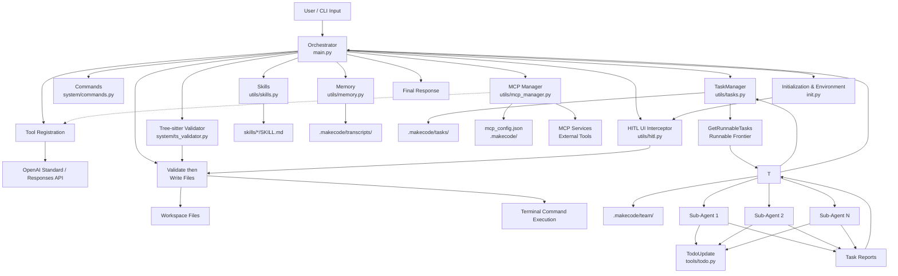

# 🚀 MakeCode · Project Documentation

🌐 Language: [简体中文](README.md) | **English** | [📦 Releases](https://github.com/cockmake/MakeCode/releases)

> A multi-agent command-line orchestrator.
>
> It supports task topology planning, concurrent sub-agent delegation, skill loading, file/terminal tools, and
> long-session compaction.

---

## 1. Overview

MakeCode is an Agent CLI designed for engineering workflows. It follows an **Orchestrator + Teammates** model:

- The orchestrator understands requests, plans work, calls tools, and merges results.
- TaskManager maintains dependency relationships and the runnable frontier.
- The Team module wakes sub-agents concurrently for parallel-safe tasks, with **automatic failure context recovery**.
- The Skills module loads domain-specific guidance on demand.
- The Memory module compacts long conversations and stores transcripts.
- The **File Access Control** module enforces read-before-edit, mtime-lock validation, and fine-grained file-level
  concurrency locks.
- **Centralized Prompt Management** unifies all LLM prompts for easier maintenance and parameterization.

The goal is not just to answer questions, but to provide an agent workflow that is **plannable, executable, traceable,
and extensible**.

---

## 🖼️ Gallery

<table>
<tr>
<td align="center"></td>
<td align="center"></td>
</tr>
<tr>
<td align="center"></td>
<td align="center"></td>
</tr>
<tr>
<td align="center"></td>
<td align="center"></td>
</tr>
</table>

---

## 2. Current Capabilities

### 2.1 Orchestrator Loop (`main.py`)

- Uses OpenAI `responses.create(...)` for multi-turn interaction.
- Automatically executes model-issued tool calls.
- Aggregates these tool groups:
    - File / Terminal tools
    - Skills tools
    - Memory tools
    - TaskManager tools
    - Team tools
- Supports Rich / tqdm / plain terminal fallback rendering.
- Shows terminal environment at startup and compacts context when needed.

### 2.2 Workspace and Environment Init (`init.py`)

MakeCode employs a strict Workspace isolation mechanism. All relative paths, environment variables, and skill loading
are resolved relative to the user's chosen **Workspace Directory (`WORKDIR`)**, not the location of the MakeCode source
code.

- **Environment Variable (`.env`) Loading**: At startup, the system automatically searches for a `.env` file within the
  currently selected `WORKDIR`. If loaded variables conflict with existing system environment variables, the CLI will
  present an interactive prompt allowing the user to decide whether to override them.
- **Skill Library (`skills/`) Loading**: The system strictly scans and loads custom skills (`SKILL.md`) from the
  `WORKDIR/skills` directory. This ensures that different projects can maintain their own dedicated skill configurations
  without interference.
- Supports interactive workspace selection (current directory or custom directory).
- **New** Supports interactive API Standard selection:
    - `Chat Completions API` (Standard format, suitable for DeepSeek, Ollama, vLLM, and standard OpenAI endpoints)
    - `Responses API` (Legacy/Custom Beta format)
- Initializes the OpenAI client from:
    - `OPENAI_API_KEY`
    - `OPENAI_BASE_URL`
    - `MODEL_ID`

### 2.3 File and Terminal Tools (`utils/common.py`) & File Access Control (`utils/file_access.py`)

Provides the following execution primitives:

- `RunRead`: read file contents, optionally by line range
- `RunWrite`: only for creating and writing a NEW file (when target file does not exist or is empty). **Automatically triggers Tree-sitter syntax validation before writing**, blocks and displays detailed error line numbers if syntax errors are detected.
- `RunEdit`: modify an existing file. **Uses text search-and-replace mechanism (search_content → replace_content) instead of line number ranges**. Must call `RunRead` first, locate changes by providing exact text with surrounding context. **Supports triple fallback: exact match → strip match → difflib fuzzy match (similarity ≥90%)**. Automatically triggers Tree-sitter syntax validation after editing.
- `RunGrep`: search text files in a target directory with a regex pattern
- `RunTerminalCommand`: run a non-interactive terminal command

#### 📋 Tree-sitter Syntax Validation (`system/ts_validator.py`) 🆕

`RunWrite` and `RunEdit` automatically invoke Tree-sitter for syntax checking before writing files:

- **Multi-language Support**: Automatically detects Python, JavaScript, TypeScript, Go, Rust, and more
- **Smart Exclusion**: Automatically skips plain text and documentation files (`.md`, `.txt`, `.rst`, `.log`, etc.) to avoid false positives
- **Detailed Error Reporting**: If syntax errors are detected, blocks the write and shows precise line/column numbers, displaying up to 5 core errors
- **Fail-Open Strategy**: Silently bypasses when language parser is unavailable, environment exception occurs, or language cannot be determined — does not block normal operations

Implementation details:

- File access is protected by workspace boundary checks.
- Terminal type is detected once at startup and then fixed.
- Windows priority: `pwsh` / `powershell` / `cmd`
- POSIX priority: `bash` / `zsh` / `sh`
- Terminal command timeout defaults to 120 seconds.

### 2.4 File Access Control Mechanism (`utils/file_access.py`)

- **Mandatory Read-Before-Edit**: Agents must use `RunRead` before editing a file, otherwise the edit is blocked.
- **Modification Time Lock Validation**: If a file is modified by another program or agent after being read, `RunEdit`is
  blocked and prompts for re-reading.
- **Fine-Grained File-Level Locks**: Multi-agent concurrent read/write uses per-file `RLock` instead of a global lock,
  improving concurrency performance.
- **Timestamp Diagnostics**: Block error messages include precise millisecond-level UTC timestamps (Last modification /
  Last read) for easier conflict troubleshooting.
- **Transactional Dependency Rollback**: `UpdateTaskDependencies` automatically rolls back the dependency list on
  topology validation failure, maintaining data consistency.

### 2.5 Human-In-The-Loop (HITL) Interceptor 🆕

To guarantee agent execution safety in real engineering environments, the system introduces a Human-In-The-Loop (HITL)
interception mechanism:

- **Sensitive Operation Blocks**: By default, file modification actions (`RunEdit`, `RunWrite`) and critical terminal
  commands (e.g. `npm`, `git`, `rm`, gated by an exclusion whitelist) are intercepted.
- **TUI Interactive Panel**: A terminal visual intercept panel built with `prompt_toolkit`, allowing the user to use
  arrow keys to choose either "Allow" or "Reject with feedback".
- **Concurrency-Safe Queuing**: During multi-sub-agent concurrent execution, the underlying system uses `ContextVar` to
  trace the identity of the agent triggering the block (e.g. `0:Orchestrator` or `1:Frontend Developer`) across
  coroutines and threads. A global `threading.Lock` enforces safe rendering of interception requests to avoid UI layout
  mess.
- **Sandbox Escape Protection**: Comprehensively catches `Ctrl+C` (`KeyboardInterrupt`) and `EOFError` within the
  interception panel. When a user forcefully interrupts an interaction, it won't crash the sub-agent to death. Instead,
  it converts the interruption into a string feedback rejecting the LLM request, letting the agent self-correct
  properly.

### 2.6 Task Management (`utils/tasks.py`)

TaskManager provides:

- `CreateTask`
- `UpdateTaskStatus`
- `UpdateTaskDependencies`
- `UpdateTaskContent` **(New)**
- `DeleteAllTasks` **(New, with forced safety confirmation)**
- `GetTask`
- `GetRunnableTasks`
- `GetTaskTable`

Key characteristics:

- Task states: `pending` / `in_progress` / `completed`
- DAG validation for active tasks to prevent dependency cycles
- A task is runnable when it is `pending` and all dependencies are completed
- Each run writes a task-plan file under `.makecode/tasks/`
- `DeleteAllTasks` provides a one-click topology reset capability, making it easy to start a fresh plan on complex
  failures.

### 2.7 Concurrent Sub-Agents (`utils/teams.py`)

The Team module supports:

- accepting only tasks from the latest `GetRunnableTasks` frontier
- running multiple sub-agents concurrently with a thread pool
- marking plan tasks as `in_progress` before execution
- syncing final task status back after execution
- writing a dedicated JSONL trace per sub-agent
- aggregating reports from one delegation batch into a combined report

Runtime artifacts include:

- `.makecode/team/task_history_{session_id}.json`
- `.makecode/team/runs/<run_id>/..._trace.jsonl`

#### 🔄 Failure Context Recovery (New)

- When a sub-agent task fails, the system automatically reads that task's `trace_log`.
- Failure records (including LLM output, tool calls, arguments, results, etc.) are formatted and injected into the retry
  task's context.
- The new sub-agent can resume from where the previous one left off, avoiding repeated errors.

### 2.8 Skill System (`utils/skills.py`)

Supports:

- `LoadSkill`: load the full content of a skill by exact name
- Skills Catalog injection: append a summary of available workspace skills (name, description, tags, and directory) to
  the end of both orchestrator and sub-agent system prompts
- Skills Catalog toggle:

Skill location: `skills/<name>/SKILL.md`. Place your custom skills in this directory within your workspace, and they
will be automatically discovered at startup.

Default behavior: the skills summary injection is enabled by default. When disabled, the UI shows `skills已关闭`, and
the skills catalog is no longer appended to orchestrator/sub-agent system prompts.

### 2.9 Conversation Compaction (`utils/memory.py`)

- Provides the `Compact` tool for history compaction.
- Saves pre-compaction transcripts into `.makecode/transcripts/`.
- Performs lightweight cleanup of older tool outputs via `micro_compact`.
- Uses the model to summarize past history and rebuild context.

### 2.10 Centralized Prompt Management (`prompts.py`) (New)

- **Unified Prompt File**: All LLM system prompts, summarization prompts, and user-guided texts are maintained in a
  single `prompts.py`.
- **HITL Defense Cognitive Implant**: Built-in specialized system instructions (for both Sub-Agent and Orchestrator)
  after interception failures, educating the LLM to understand why "Human-In-The-Loop" rejected its request, prompting
  the LLM to autonomously adapt rather than retrying blindly.
- Includes the following prompt generator functions:
    - `get_orchestrator_system_prompt()`: Orchestrator system prompt
    - `get_sub_agent_system_prompt()`: Sub-agent system prompt
    - `get_sub_agent_summary_prompt()`: Summary prompt when sub-agent fails
    - `get_report_assistant_system_prompt()`: Report assistant system prompt
    - `get_summary_system_prompt()` / `get_summary_user_prompt()`: Conversation compaction prompts
    - `get_skill_system_note()`: System note for skill loading

### 2.11 Conversation History and Loading (`/load`)

- The `/load` command supports restoring any historical session from a Checkpoint, including the main agent conversation
  chain and sub-agent execution histories.
- **Full UI Re-rendering**: After loading a history record, the system automatically clears the screen (
  `console.clear()`) and re-renders every message (including User inputs, AI text, Tool call intents, and Tool execution
  results) according to the latest terminal UI styling.
- **Configuration Anti-Pollution**: When loading a historical Checkpoint, the system automatically syncs the latest
  System Prompt and global configurations (such as the current date, MCP/Skills toggle status) to prevent them from
  being overwritten by old data.
- For sub-agent histories, the system only prompts for loading after the task plan is successfully loaded. If all tasks
  in the plan are already completed, it automatically skips the prompt.

### 2.12 Sub-Agent Todo Tool (`tools/todo.py`)

Sub-agents can use the `TodoUpdate` tool to maintain a lightweight todo list for multi-step task tracking.

### 2.13 MCP Service Integration (`utils/mcp_manager.py`)🆕

MakeCode supports integrating external tools and services via the **Model Context Protocol (MCP)**, extending the
agent's capability boundary.

#### Core Features

- **Configuration-Driven Loading**: Declaratively configure multiple MCP services via `mcp_config.json`, supporting
  standard protocol integration
- **Asynchronous Lifecycle Management**: Initialize and manage MCP clients asynchronously in a background thread to
  avoid blocking the main loop
- **Dynamic Service Control**: Enable/disable specific MCP services at runtime for flexible toolset adjustment
- **Unified Tool Registration**: Automatically extract tool definitions from MCP services, format them consistently with
  built-in tools, and seamlessly integrate into `llm_client`
- **Error Isolation & Recovery**: Failure to load a single MCP service does not affect others; detailed error logs and
  graceful degradation are provided

#### Configuration Example

Create `.makecode/mcp_config.json` in your workspace:

```json
{
  "mcpServers": {
    "filesystem": {
      "command": "npx",
      "args": [
        "-y",
        "@modelcontextprotocol/server-filesystem",
        "/path/to/workspace"
      ]
    },
    "git": {
      "command": "npx",
      "args": [
        "-y",
        "@modelcontextprotocol/server-git"
      ]
    }
  }
}
```

#### Usage Flow

1. **Configure**: Define MCP services to integrate in `mcp_config.json`
2. **Start**: MakeCode automatically loads the config and starts MCP clients at initialization
3. **Discover**: System automatically extracts tool lists from MCP services and registers them
4. **Invoke**: Agents can use MCP-provided capabilities via the standard tool call interface
5. **Monitor**: Check MCP service status via logs and status tools

#### Related Components

- `utils/mcp_manager.py`: MCP service manager responsible for config loading, client management, and tool registration
- `utils/llm_client.py`: Unified tool format extractor, compatible with both MCP native Tool and pydantic_function_tool
- `main.py`: Integrates `GLOBAL_MCP_MANAGER` into the main loop to ensure full toolset availability

> 💡 **Tip**: MCP service integration is optional. If `mcp_config.json` is not configured, the system will skip loading
> and continue normal operation.

---
---

## 3. Project Structure

```text
Agent/
├─ main.py                  # orchestrator loop and CLI entry
├─ init.py                  # .env loading, workspace selection, OpenAI client init
├─ prompts.py               # centralized management of all LLM prompts
├─ requirements.txt         # project dependencies
├─ README.md
├─ README_en.md
├─ tools/
│  └─ todo.py               # internal todo manager for sub-agents
├─ utils/
│  ├─ llm_client.py         # LLM standard adapter (Chat vs Response API)
│  ├─ hitl.py               # Human-In-The-Loop interceptor and UI (🆕)
│  ├─ common.py             # file / terminal / grep primitives
│  ├─ file_access.py        # file access control and fine-grained concurrency locks
│  ├─ mcp_manager.py        # MCP service manager, config loading & tool registration 🆕
│  ├─ tasks.py              # TaskManager topology and status logic
│  ├─ teams.py              # concurrent delegation and execution logs
│  └─ memory.py             # transcript saving and history compaction
├─ system/
│  ├─ commands.py           # slash command module (descriptions, completer, interactive panels)
│  └─ ts_validator.py        # Tree-sitter syntax validation module
├─ skills/
│  ├─ pdf/
│  │  └─ SKILL.md
│  └─ code-review/
│     └─ SKILL.md
└─ build/                   # build artifacts / packaging files if present
```

Runtime-generated directories:

- `.makecode/tasks/`: task-plan JSON files
- `.makecode/team/`: sub-agent history and run logs
- `.makecode/transcripts/`: transcripts saved before compaction

### 3.2 Architecture Diagram (Mermaid)



### 3.3 Architecture Overview

- `main.py` is the main orchestrator, handling model conversations, tool calls, and the main loop.
- `init.py` provides workspace selection, environment variable loading, and OpenAI client initialization.
- `prompts.py` centrally manages all LLM prompts for easier maintenance and parameterization.
- `utils/common.py` provides file read/write, line-based editing, text search, and terminal command execution.
- `utils/hitl.py` 🆕 manages secure interception of high-risk commands and destructive operations through a globally
  queued TUI, complete with trace context for concurrency safety.
- `utils/file_access.py` implements file access control: mandatory read-before-edit, mtime-lock validation, and
  fine-grained file-level concurrency locks.
- `utils/tasks.py` maintains task DAG, state transitions, and runnable frontier.
- `utils/teams.py` delegates the latest runnable tasks to sub-agents concurrently, collects results, and supports
  failure context recovery.
- `utils/skills.py` provides skill discovery and content loading.
- `utils/memory.py` handles long-session compaction and transcript saving.
- `utils/mcp_manager.py` 🆕 manages MCP service configuration loading, client lifecycle, tool extraction and
  registration, with support for dynamic enable/disable.
- `system/ts_validator.py` 🆕 provides Tree-sitter syntax validation, automatically detecting code syntax errors before file writes.
- `system/commands.py` 🆕 handles slash command definitions, completion, and interactive panel processing.
- `tools/todo.py` allows sub-agents to maintain internal todos for multi-step task tracking.

---
---

## 4. Execution Flow

A typical flow looks like this:

1. The user submits a task.
2. The orchestrator decides whether to create or update a TaskManager plan first.
3. The model returns tool calls.
4. The orchestrator executes those tools and feeds results back.
5. If parallel work exists, it calls `GetRunnableTasks` first.
6. It delegates the latest runnable frontier through `DelegateTasks`.
7. Sub-agents finish and return reports.
8. The orchestrator continues until it can produce the final answer.

---

## 5. Requirements

- Python 3.10+
- Access to an OpenAI-compatible endpoint
- A model that supports the Chat Completions API or Responses API

Dependencies currently declared in `requirements.txt`:

- `openai`
- `pydantic`
- `prompt_toolkit`
- `python-dotenv`
- `rich`
- `tqdm`

---

## 6. Installation and Run

### 6.1 Install dependencies

```bash
pip install -r requirements.txt
```

### 6.2 Prepare Workspace (Important)

MakeCode employs a strict Workspace isolation mechanism. It is **not recommended** to run tasks directly in the MakeCode
source directory. Instead, prepare the following in your actual project directory (the directory where you want the
Agent to work):

1. **Environment Configuration `.env`**:
   Create a `.env` file in the root of your target workspace directory and fill in the model configuration:
   ```env
   OPENAI_BASE_URL=your_endpoint
   OPENAI_API_KEY=your_api_key
   MODEL_ID=your_model_id
   ```
   > Note: The model behind `MODEL_ID` must support the Chat Completions API or Responses API. If any variables in this
   file conflict with existing system environment variables, MakeCode will prompt you interactively at startup to choose
   whether to override them.

2. **Custom Skills Library `skills/` (Optional)**:
   If your project requires specific expert skills, create a `skills` folder in the root of your target workspace
   directory.
   The structure should look like this: `skills/<skill-name>/SKILL.md`. MakeCode will strictly load skills only from
   this directory.

### 6.3 Start

Run the following command in the MakeCode source directory to start the CLI:

```bash
python main.py
```

After startup, you will enter a wizard flow:

1. **Interactive Workspace Selection (WORKDIR)**: Enter the directory (absolute path) where you just prepared your`.env`
   and `skills`, or press Enter to use the current directory.
2. **Resolve Environment Variable Conflicts**: If there are conflicts between your `.env` file and system variables,
   follow the prompt to confirm overrides.
3. **Select API Standard**: Choose your underlying API protocol (Chat Completions API or Responses API).
4. **Enter Interactive Terminal**: Begin your conversation with the main agent.

### 6.4 Built-in Slash Commands

In the interactive CLI, you can type `/` to trigger quick commands (with auto-completion support):

| Command              | Description                                                                                                                                      |
|----------------------|--------------------------------------------------------------------------------------------------------------------------------------------------|
| `/cmds`              | List all available commands and their descriptions                                                                                               |
| `/mcp-view`          | View the MCP status overview and the currently loaded MCP tool list                                                                              |
| `/mcp-restart`       | Restart the MCP background manager and reload configuration                                                                                      |
| `/mcp-switch`        | Interactively toggle MCP services on/off, save changes to `.makecode/mcp_config.json` after confirmation, and attempt incremental enable/disable |
| `/load`              | List historical checkpoints and select one to load                                                                                               |
| `/skills-switch`     | Toggle skills catalog injection status (On/Off)                                                                                                  |
| `/skills-list`       | List available skills in the current workspace                                                                                                   |
| `/compact`           | Compact the current conversation context                                                                                                         |
| `/tools`             | List detailed information of available tools                                                                                                     |
| `/tasks` / `/plan`   | View the task board and current execution progress                                                                                               |
| `/status`            | Report system status, completed tasks, and next steps                                                                                            |
| `/help`              | Show usage help and self-introduction                                                                                                            |
| `/workspace` / `/ls` | View the current workspace directory structure                                                                                                   |
| `/clear` / `/reset`  | Clear current conversation history                                                                                                               |
| `/quit` / `/exit`    | Exit the program                                                                                                                                 |

> 💡 **Tip: MCP-related commands**
> - `/mcp-view`: First shows an MCP status overview, including configured services / enabled in config / disabled in
    config / currently loaded services, then displays the detailed loaded tool table.
> - `/mcp-restart`: Force restarts the MCP background manager, re-reads `.makecode/mcp_config.json`, and reinitializes
    services.
> - `/mcp-switch`: Opens an interactive switch panel. Use `↑/↓` to select a service, `Space` to toggle the draft state,
    and the bottom actions to either confirm or cancel. On confirm, the updated `disabled` values are written back to
    the config file first, then the system attempts incremental enable/disable for the affected services. On cancel,
    nothing is saved and runtime state remains unchanged.
---

## 7. Operational Constraints

Important built-in rules include:

- Prefer File tools for file reads, writes, edits, and text search.
- Regular file manipulation should not rely on shell commands.
- Always call `GetRunnableTasks` before delegation.
- `DelegateTasks` only accepts tasks from the latest runnable frontier.
- Only parallel-safe and independent tasks should be delegated concurrently.
- Terminal commands must be non-interactive and safe.

---

## 8. How to Extend

### 8.1 Add a Skill

1. Create `skills/<name>/`
2. Add `SKILL.md`
3. Optionally include frontmatter fields:
    - `name`
    - `description`
    - `tags`
4. New skills are automatically rescanned and summarized into the Skills Catalog the next time system prompts are built;
   use `/skills-switch` to toggle that injection temporarily
5. When the full skill content is actually needed, the agent can call `LoadSkill` directly

### 8.2 Add a Tool

The current tool registration flow is based on `openai.pydantic_function_tool(...)` plus `make_response_tool(...)`.

Typical steps:

1. Define a Pydantic model
2. Implement the handler function
3. Register the tool in the proper tool collection
4. Add the handler into the related `*_HANDLERS`
5. Include it in the main orchestrator tool aggregation

### 8.3 Code Style and Emoji Formatting

To prevent style and layout messes caused by frequent use of Emojis in CLI outputs and Markdown documents, MakeCode
adopts a unified **V2 Emoji Formatting Strategy**:

- **Left Snug**: If the Emoji is immediately to the right of quotes (`"`, `'`), brackets/tags (`[`, `]`, `(`, `{`, `<`),
  or is at the beginning of a line, the space before the Emoji is removed (e.g., `"[bold red]⚠️"`, `"[📦 Releases]"`).
- **Right Snug**: If the Emoji is immediately to the left of closing punctuation (`"`, `'`, `]`, `}`, `>`, `.`, `,`,`。`,
  `，`, `！`, etc.), or is at the end of a line, the space after the Emoji is removed (e.g., `"User 🤖"`).
- **Normal Spacing**: If the above conditions are not met, and the left/right side is plain text or Markdown control
  characters (`#`, `-`, `*`, etc.), exactly one space is strictly kept on the left/right side of the Emoji (e.g.,
  `Hello 🤖 `, `# 🤖 Title`).

> All `.py` source files and `.md` documents strictly adhere to this formatting strategy.

---

## 9. Troubleshooting

### 9.1 Missing environment variables

If startup fails, check:

- `OPENAI_API_KEY`
- `OPENAI_BASE_URL`
- `MODEL_ID`

### 9.2 Path escapes workspace

`RunRead`, `RunWrite`, `RunEdit`, and `RunGrep` all enforce workspace boundaries. Paths outside the workspace are
rejected.

### 9.3 Terminal command failures

Make sure:

- the detected startup terminal actually exists
- the command does not require interactive input
- the command does not exceed the 120-second timeout

### 9.4 Why delegation fails

Common causes:

- the task is not in the latest `GetRunnableTasks` result
- some dependencies are not completed yet
- duplicated or unknown task IDs were passed in
