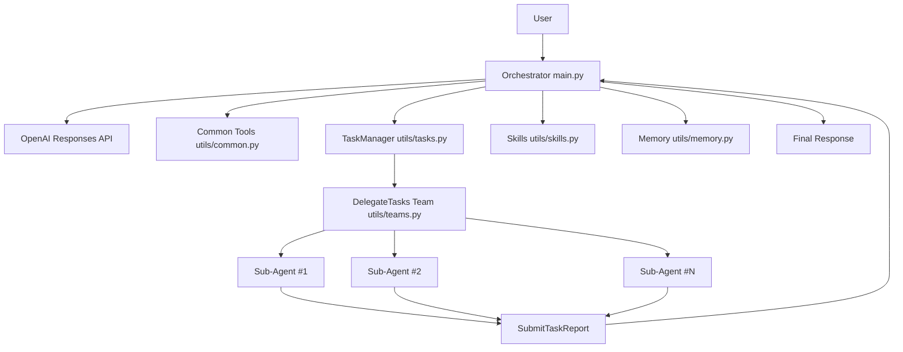

# 🚀 MakeCode · Project Documentation

🌐 Language: [简体中文](README.md) | **English**

> ✅ Currently supports the **OpenAI Response API**.

A **MakeCode-powered multi-agent command-line assistant** built on the **OpenAI Responses API**.  
This project supports task topology management, concurrent sub-agent delegation, dynamic skill loading, file/terminal tools, and conversation compaction for complex engineering workflows.

---

## 📌 1. Project Positioning

MakeCode follows an **Orchestrator + Teammates** model:

- 🧠 The orchestrator understands requests, plans execution, calls tools, and coordinates flow.
- 👥 Sub-agents execute independent tasks in parallel and submit structured reports.
- 🕸️ Task dependencies are enforced by TaskManager to guarantee safe ordering.

Goal: make the agent not only “answer questions” but also **execute tasks reliably, trace progress, and scale**.

---

## ✨ 2. Core Capabilities

### 🧠 2.1 Orchestrator Loop (`main.py`)

- Maintains multi-turn chat history.
- Executes model-issued `function_call` actions.
- Renders output with Rich / tqdm / plain terminal fallback.
- Applies lightweight context compaction (`micro_compact`) on long sessions.

### 🧰 2.2 Tooling Layer (`utils/common.py`)

Core tools:

- `RunRead`: read files (line-range support)
- `RunWrite`: write files (auto-create parent dirs)
- `RunEdit`: replace specific line ranges
- `RunTerminalCommand`: run non-interactive shell commands

The runtime terminal is auto-detected (Windows priority: `pwsh` / `powershell` / `cmd`).

### 🗂️ 2.3 Task Topology (`utils/tasks.py`)

TaskManager APIs:

- `CreateTask`
- `UpdateTaskStatus`
- `UpdateTaskDependencies`
- `GetTask`
- `GetRunnableTasks`
- `GetTaskTable`

Highlights:

- Built-in DAG validation (cycle detection).
- Runnable task definition: `pending` + all dependencies `completed`.
- Plans are persisted under `.tasks/`.

### 👥 2.4 Team Delegation (`utils/teams.py`)

- `DelegateTasks` only accepts tasks from the latest runnable frontier.
- Runs sub-agents concurrently via thread pool.
- Writes per-agent JSONL traces.
- Syncs task states back into TaskManager and aggregates final reports.

### 🧩 2.5 Skill Loading (`utils/skills.py` + `skills/*`)

- `ListSkills`: discover available skills
- `LoadSkill`: load full skill content

Built-in sample skills:

- `pdf`
- `code-review`

### 🧠 2.6 Memory Compaction (`utils/memory.py`)

- Stores raw conversation transcripts in `.transcripts/`
- Summarizes history through model calls
- Preserves essential system/current-turn context

---

## 🏗️ 3. Architecture Diagram

### High-Level Flow (Mermaid)



### Interaction Notes

- `main.py` is the control center for model + tool execution loops.
- `utils/tasks.py` controls dependency-aware scheduling.
- `utils/teams.py` handles concurrent execution and reporting.
- `utils/common.py`, `utils/skills.py`, and `utils/memory.py` provide execution, knowledge extension, and context governance.

### 📸 Real Demo (Process & Result)

The following images show the full path from execution steps to final output:

**Step 1 (highlighted first)**

<p align="center">
  
</p>

**Remaining steps and result (2x2)**

| Step 2 | Step 3 |
| --- | --- |
|  |  |
|  |  |

---

## 📁 4. Directory Structure

```text
Agent/
├─ main.py
├─ init.py
├─ requirements.txt
├─ tools/
│  └─ todo.py
├─ utils/
│  ├─ common.py
│  ├─ tasks.py
│  ├─ teams.py
│  ├─ skills.py
│  └─ memory.py
└─ skills/
   ├─ pdf/SKILL.md
   └─ code-review/SKILL.md
```

Runtime-generated directories:

- `.tasks/` task-plan JSON files
- `.team/` sub-agent history and run logs
- `.transcripts/` raw transcripts before compaction

---

## ⚙️ 5. Requirements

- Python 3.10+ (recommended 3.11/3.12)
- Access to an OpenAI-compatible endpoint

---

## 🚀 6. Setup and Run

### Install dependencies

```bash
pip install -r requirements.txt
```

### Configure `.env`

```env
OPENAI_BASE_URL=your_endpoint
OPENAI_API_KEY=your_api_key
MODEL_ID=your_model_id
```

### Start

```bash
python main.py
```

At startup, the app lets you select a workspace directory, then enters interactive multi-turn CLI mode.

---

## 🔄 7. End-to-End Workflow

1. User submits a request
2. Orchestrator asks model for the next action
3. Tool calls are executed and fed back to model context
4. TaskManager builds/updates dependency graph if needed
5. Runnable tasks are delegated concurrently to sub-agents
6. Sub-agents return `SubmitTaskReport`
7. Orchestrator merges results and returns final output

---

## 🧱 8. Important Constraints

- Prefer File tools over shell for regular file operations.
- Always call `GetRunnableTasks` before delegation.
- DAG validation is enforced for active tasks.
- Terminal commands are non-interactive and timeout by default (120s).

---

## 🩺 9. Troubleshooting

### Missing env vars

Ensure these are set:

- `OPENAI_BASE_URL`
- `OPENAI_API_KEY`
- `MODEL_ID`

### Path boundary errors

`RunRead`/`RunWrite`/`RunEdit` enforce workspace-safe paths.

### Encoding issues in terminal output

The command runner tries UTF-8 first, then falls back to system encoding.

### Delegation rejected

Verify task IDs are included in the **latest** `GetRunnableTasks` output.

---

## 🛠️ 10. Extending the Project

### Add a new skill

1. Create `skills/<name>/SKILL.md`
2. Add frontmatter: `name`, `description` (optional `tags`)
3. Restart and load via `ListSkills` / `LoadSkill`

### Add a new tool

1. Define a Pydantic model + handler
2. Register with `make_response_tool(pydantic_function_tool(...))`
3. Merge into `SUPER_TOOLS` and `SUPER_TOOLS_HANDLERS`

---

## 📦 11. Dependencies

- `openai`
- `pydantic`
- `prompt_toolkit`
- `python-dotenv`
- `rich`
- `tqdm`

---

## 📄 12. License

No explicit license file is currently included.  
For open-source release, consider adding `LICENSE` and `CONTRIBUTING`.

