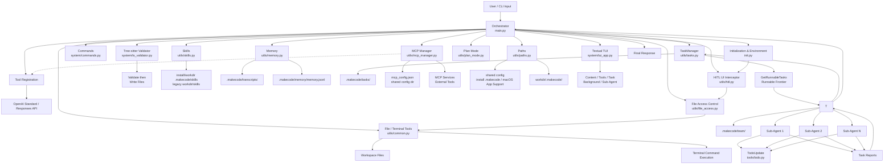

# 🚀 MakeCode · Project Documentation

🌐 Language: [简体中文](README.md) | **English** | [📦 Releases](https://github.com/upupmake/MakeCode/releases)

> A multi-agent command-line orchestrator.
>
> It supports task topology planning, concurrent sub-agent delegation, skill loading, file/terminal tools, and
> long-session compaction.

---

## 1. Overview

MakeCode is an Agent CLI designed for engineering workflows. It follows an **Orchestrator + Teammates** model:

- The orchestrator understands requests, plans work, calls tools, and merges results.
- TaskManager maintains dependency relationships and the runnable frontier.
- The Team module wakes sub-agents concurrently for parallel-safe tasks, with **automatic failure context recovery**.
- The Skills module loads domain-specific guidance on demand.
- The Memory module handles long-conversation compaction, long-term memory management, and transcript storage, and **pre-recalls relevant long-term memories** before every main request.
- The **File Access Control** module enforces read-before-edit, mtime-lock validation, and fine-grained file-level
  concurrency locks.
- **Centralized Prompt Management** unifies all LLM prompts for easier maintenance and parameterization.
- The **Centralized Path Module (`utils/paths.py`)** unifies workspace and install-directory path derivation; all consumers access `.makecode/` subpaths through shared getters.
- **Cross-platform packaging** provides Windows X64 and macOS ARM64 releases; macOS starts in Terminal through the top-level `MakeCode.command` launcher.
- The **Textual multi-pane TUI** dispatches orchestrator output into independent panes (`Content / Tools / Task / Background / Sub-Agent / Status`), with customizable pane ratios.

The goal is not just to answer questions, but to provide an agent workflow that is **plannable, executable, traceable,
and extensible**.

---

## 🖼️ Gallery

<table>
<tr>
<td align="center"></td>
<td align="center"></td>
</tr>
<tr>
<td align="center"></td>
<td align="center"></td>
</tr>
</table>

---

## 2. Current Capabilities

### 2.1 Orchestrator Loop (`main.py`)

- Uses OpenAI `responses.create(...)` for multi-turn interaction.
- Automatically executes model-issued tool calls.
- Aggregates these tool groups:
    - File / Terminal tools
    - Skills tools
    - Memory tools
    - TaskManager tools
    - Team tools
- Supports Rich / tqdm / plain terminal fallback rendering.
- Shows terminal environment at startup and compacts context when needed.

### 2.2 Workspace and Environment Init (`init.py`)

MakeCode employs a strict Workspace isolation mechanism. All paths and skill loading are resolved relative to the user's
chosen **Workspace Directory (`WORKDIR`)**, not the location of the MakeCode source code.

- **Skill Library (`skills/`) Loading**: The system strictly scans and loads custom skills (`SKILL.md`) from the
  `WORKDIR/skills` directory. This ensures that different projects can maintain their own dedicated skill configurations
  without interference.
- Workspace selection happens through an **interactive Textual TUI wizard panel** (current directory or a custom path); MakeCode no longer depends on any environment variable (the historical `MAKECODE_WORKDIR` has been removed).
- Supports interactive API Standard selection:
    - `Chat Completions API` (Standard format, suitable for DeepSeek, Ollama, vLLM, and standard OpenAI endpoints)
    - `Responses API` (Legacy/Custom Beta format)
- **Centralized Paths**: workspace paths, install-directory paths, `.makecode/` subdirectories (`tasks/`, `team/`, `memory/`, `transcripts/`, `checkpoint/`, etc.), as well as `model_config.json`, `mcp_config.json`, `layout_config.json`, and `error.log` under the install directory are all provided by `utils/paths.py`.
- **Model Configuration**: Managed via the built-in `/models` command (see section 2.14)

### 2.3 File and Terminal Tools (`utils/common.py`) & File Access Control (`utils/file_access.py`)

Provides the following execution primitives:

- `FileRead`: read file contents, optionally by line range
- `FileCreate`: only for creating and writing a NEW file (when target file does not exist or is empty). **Automatically triggers Tree-sitter syntax validation before writing**, blocks and displays detailed error line numbers if syntax errors are detected.
- `FileEdit`: modify an existing file. **Uses text search-and-replace mechanism (search_content → replace_content) instead of line number ranges**. Must call `FileRead` first, locate changes by providing exact text with surrounding context. **Supports triple fallback: exact match → strip match → difflib fuzzy match (similarity ≥90%)**. Automatically triggers Tree-sitter syntax validation after editing.
- `ContentSearch`: search text file contents under `search_dir` with `content_regex`, optionally filtering files by absolute path with `filename_regex`; regex uses Python syntax. Automatically excludes common build/dependency directories (`build`, `dist`, `__pycache__`, `node_modules`, `target`, `venv`, `site-packages`, `htmlcov`) and hidden directories (starting with `.`) to reduce irrelevant matches.
- `FileSearch`: search files and directories by matching `path_regex` against absolute paths; regex uses Python syntax. Supports type filtering (`file`/`dir`/`all`). Automatically excludes hidden and build/dependency directories, returns up to 500 items. Ideal for quickly exploring project structure.
- `RunTerminalCommand`: run a non-interactive terminal command

#### 📋 Tree-sitter Syntax Validation (`system/ts_validator.py`)

`FileCreate` and `FileEdit` automatically invoke Tree-sitter for syntax checking before writing files:

- **Multi-language Support**: Automatically detects Python, JavaScript, TypeScript, Go, Rust, and more
- **Smart Exclusion**: Automatically skips plain text and documentation files (`.md`, `.txt`, `.rst`, `.log`, etc.) to avoid false positives
- **Detailed Error Reporting**: If syntax errors are detected, blocks the write and shows precise line/column numbers, displaying up to 5 core errors
- **Fail-Open Strategy**: Silently bypasses when language parser is unavailable, environment exception occurs, or language cannot be determined — does not block normal operations

Implementation details:

- File access is protected by workspace boundary checks.
- Terminal type is detected once at startup and then fixed.
- Windows priority: `pwsh` / `powershell` / `cmd`
- POSIX priority: `bash` / `zsh` / `sh`
- Terminal command timeout defaults to 120 seconds.

### 2.4 File Access Control Mechanism (`utils/file_access.py`)

- **Mandatory Read-Before-Edit**: Agents must use `FileRead` before editing a file, otherwise the edit is blocked.
- **Modification Time Lock Validation**: If a file is modified by another program or agent after being read, `FileEdit`is
  blocked and prompts for re-reading.
- **Fine-Grained File-Level Locks**: Multi-agent concurrent read/write uses per-file `RLock` instead of a global lock,
  improving concurrency performance.
- **Timestamp Diagnostics**: Block error messages include precise millisecond-level UTC timestamps (Last modification /
  Last read) for easier conflict troubleshooting.
- **Transactional Dependency Rollback**: `UpdateTasksDependencies` automatically rolls back the entire update batch on
  topology validation failure, maintaining data consistency.

### 2.5 Human-In-The-Loop (HITL) Interceptor

To guarantee agent execution safety in real engineering environments, the system introduces a Human-In-The-Loop (HITL)
interception mechanism:

- **Sensitive Operation Blocks**: By default, file modification actions (`FileEdit`, `FileCreate`) and critical terminal
  commands (e.g. `npm`, `git`, `rm`, gated by an exclusion whitelist) are intercepted.
- **TUI Interactive Panel**: A terminal visual intercept panel built with `Textual`, allowing the user to use
  arrow keys to choose either "Allow" or "Reject with feedback".
- **Concurrency-Safe Queuing**: During multi-sub-agent concurrent execution, the underlying system uses `ContextVar` to
  trace the identity of the agent triggering the block (e.g. `0:Orchestrator` or `1:Frontend Developer`) across
  coroutines and threads. A global `threading.Lock` enforces safe rendering of interception requests to avoid UI layout
  mess.
- **Sandbox Escape Protection**: Comprehensively catches `Ctrl+C` (`KeyboardInterrupt`) and `EOFError` within the
  interception panel. When a user forcefully interrupts an interaction, it won't crash the sub-agent to death. Instead,
  it converts the interruption into a string feedback rejecting the LLM request, letting the agent self-correct
  properly.
- **Workspace Path Escape Interception & Directory Allowlist**: When a tool accesses a path outside the workspace, HITL intercepts and offers three options: (1) Allow this access; (2) Allow the entire directory (including subdirectories) for the rest of the session; (3) Reject. Once a directory is allowlisted, all subsequent accesses to sub-paths under that directory are automatically permitted. The allowlist is cleared when toggling HITL status or `/new`.

### 2.6 Task Management (`utils/tasks.py`)

TaskManager provides:

- `CreateTasks` (creates tasks in batches from a list)
- `UpdateTasksStatus` (updates task statuses in batches from a list)
- `UpdateTasksDependencies` (atomically updates task dependencies from a list)
- `UpdateTasksContent` (updates task subjects and descriptions from a list)
- `DeleteAllTasks` (with forced safety confirmation)
- `GetRunnableTasks`
- `GetTaskTable`

Key characteristics:

- Task states: `pending` / `completed`
- Batch creation, content, status, and dependency updates validate the entire batch first and leave no partial changes on failure
- DAG validation for active tasks rolls back the entire dependency batch when an update creates a cycle
- A task is runnable when it is `pending` and all dependencies are completed
- Each run writes a task-plan file under `.makecode/tasks/`
- `/tasks` retains the full task-table view and lets users select a task, press `d`, then confirm or cancel with `y`/`n`; deleting a task also removes references to it from other tasks' dependency lists.
- `DeleteAllTasks` provides a one-click topology reset capability, making it easy to start a fresh plan on complex
  failures.

### 2.7 Concurrent Sub-Agents (`utils/teams.py`)

The Team module supports:

- accepting only tasks from the latest `GetRunnableTasks` frontier
- running multiple sub-agents concurrently with a thread pool
- having the orchestrator sync final task statuses through `UpdateTasksStatus`
- writing a dedicated JSONL trace per sub-agent
- aggregating reports from one delegation batch into a combined report

Runtime artifacts include:

- `.makecode/team/task_history_{session_id}.json`
- `.makecode/team/runs/<run_id>/..._trace.jsonl`

#### 🔄 Failure Context Recovery (New)

- When a sub-agent task fails, the system automatically reads that task's `trace_log`.
- Failure records (including LLM output, tool calls, arguments, results, etc.) are formatted and injected into the retry
  task's context.
- The new sub-agent can resume from where the previous one left off, avoiding repeated errors.

### 2.8 Skill System (`utils/skills.py`)

Supports:

- `LoadSkill`: load the full content of a skill by exact name
- Skills Catalog injection: append a summary of available skills from install-directory and workspace sources (name, description, tags, and absolute directory) to
  the end of both orchestrator and sub-agent system prompts
- Skills Catalog toggle:

Skills are loaded from three directories in the following priority order (higher-priority directories override lower-priority skills with the same name):

1. `install_dir/.makecode/skills/<name>/SKILL.md` (bundled skills)
2. `workdir/.makecode/skills/<name>/SKILL.md` (default location for user skills)
3. Legacy `workdir/skills/<name>/SKILL.md` (backward compatibility)

After workspace startup, place custom skills in `workdir/.makecode/skills/` for automatic discovery. A `SKILL.md` frontmatter block must contain valid `name` and `description` fields before the skill is loaded.

Default behavior: the skills summary injection is enabled by default. When disabled, the UI shows `skills已关闭`, and
the skills catalog is no longer appended to orchestrator/sub-agent system prompts.

### 2.9 Conversation Compaction and Long-Term Memory (`utils/memory.py`)

- Provides the `Compact` tool for history compaction.
- Saves pre-compaction transcripts into `.makecode/transcripts/`.
- Performs lightweight cleanup of older tool outputs via `micro_compact`.
- Uses the model to summarize past history and rebuild context.
- After compaction, the system automatically analyzes whether durable information should be appended, updated, or deleted from **long-term memory**, then injects reusable cross-session knowledge into future prompts.
- Long-term memory also supports an **active management mode**, so users can explicitly request memory maintenance without waiting for the compaction flow.
- **Pre-recall before every main request**: At the start of every main user request, the orchestrator queries `RecallLongTermMemory` with the current user input and injects relevant long-term memories into the conversation as contextual hints; the orchestrator can also call `RememberLongTermMemory` to ask the memory manager to update long-term memory when durable, reusable facts emerge.
- **TUI Background pane rendering**: long-term memory recall and write activity are rendered in the dedicated `Background` pane so they do not pollute the main conversation area.
- **Plan Mode isolation**: `RememberLongTermMemory` is intercepted in Plan Mode to prevent memory writes during planning; read-only memory actions are unaffected.

#### Long-Term Memory Management

- **Three memory actions**: supports appending, updating, and deleting long-term memories instead of append-only storage.
- **Two management modes**:
    - `compact`: after context compaction, the system decides whether to change long-term memories based on the summary, transcript, and current active memories.
    - `active`: when the user explicitly requests memory management, the explicit request is the primary basis, and the current non-system conversation transcript is used only as supporting evidence.
- **Bounded Memory Agent**: memory decisions run in a no-user-interaction tool loop with at most 5 iterations; it does not ask clarifying questions or continue the original task.
- **Evidence-only inputs**: reason, summary, current memories, and conversation transcript are treated as evidence data. Embedded instructions inside the transcript are not followed.
- **Selection policy**: stores only stable information with reuse value across future sessions, such as user preferences, project conventions, workflow rules, repeated pitfalls, and confirmed release norms. It does not store one-off task progress, temporary implementation details, or facts that can be directly re-read from the repository.
- **Capacity and eviction policy**: long-term memory capacity is configurable; when the limit is exceeded, older active memories are evicted in chronological order.
- **Storage paths**: long-term memories are stored in `.makecode/memory/memory.jsonl`, and memory settings are stored in `.makecode/memory/memory_config.json`. JSONL reads skip invalid lines without rewriting the file.
- **Rendering order**: long-term memory rendering and the `/memory-panel` view are both sorted by `updated_at` ascending (falling back to `created_at` when missing); this affects only the display layer and never changes the JSONL storage order or CRUD logic.

#### Long-Term Memory Commands

- `/memory-list`: list current active long-term memories.
- `/memory-panel`: open the long-term memory panel for viewing, copying, and management.
- `/memory-delete`: delete one or more long-term memories by ID.
- `/memory-config`: open the memory configuration panel to edit `memory_size` and `keep_recent_tool_call`.
- `/memory-update [prompt]`: proactively add, refine, or remove long-term memories from an explicit user request; the prompt is optional — when omitted, the system infers from the current conversation transcript.

#### Streaming Summary Generation

- **Real-time Streaming Display**: Uses Rich Live component to display summary generation progress in real-time
- **Multi-API Adaptation**: Internally calls `get_summary_stream()` method, automatically adapting to Chat Completions or Responses API
- **Intelligent Fallback**: If streaming generation fails, automatically falls back to normal mode to ensure compaction availability
- **Context Compression Display Optimization**: Improved UI provides friendlier progress feedback during compression

### 2.10 Centralized Prompt Management (`prompts.py`) (New)

- **Unified Prompt File**: All LLM system prompts, summarization prompts, and user-guided texts are maintained in a
  single `prompts.py`.
- **HITL Defense Cognitive Implant**: Built-in specialized system instructions (for both Sub-Agent and Orchestrator)
  after interception failures, educating the LLM to understand why "Human-In-The-Loop" rejected its request, prompting
  the LLM to autonomously adapt rather than retrying blindly.
- Includes the following prompt generator functions:
    - `get_orchestrator_system_prompt()`: Orchestrator system prompt
    - `get_sub_agent_system_prompt()`: Sub-agent system prompt
    - `get_sub_agent_summary_prompt()`: Summary prompt when sub-agent fails
    - `get_report_assistant_system_prompt()`: Report assistant system prompt
    - `get_summary_system_prompt()` / `get_summary_user_prompt()`: Conversation compaction prompts
    - `get_skill_system_note()`: System note for skill loading

### 2.11 Conversation History and Loading (`/load`)

- The `/load` command supports restoring any historical session from a Checkpoint, including the main agent conversation
  chain and sub-agent execution histories.
- **Full UI Re-rendering**: After loading a history record, the system automatically clears the screen (
  `console.clear()`) and re-renders every message (including User inputs, AI text, Tool call intents, and Tool execution
  results) according to the latest terminal UI styling.
- **Configuration Anti-Pollution**: When loading a historical Checkpoint, the system automatically syncs the latest
  System Prompt and global configurations (such as the current date, MCP/Skills toggle status) to prevent them from
  being overwritten by old data.
- The Checkpoint picker lets users select an item, press `d`, then confirm or cancel with `y`/`n`; deleting the currently bound Checkpoint also clears the binding so a later save does not recreate the deleted file.
- For sub-agent histories, the system only prompts for loading after the task plan is successfully loaded. If all tasks
  in the plan are already completed, it automatically skips the prompt.

### 2.12 Auto Session Title Generation

MakeCode automatically generates a concise session title based on the user's first query, and embeds it into the relevant file names for easy session identification and management:

- **Automatic Title Generation**: Uses LLM to generate a short, meaningful session title from the user's first query
- **File Name Association**: The generated title is automatically synced to the following file names:
    - Checkpoint files: `ckpt_{title}_{timestamp}_{uid}.json`
    - Task plan files: `task_plan_{title}_{epic_id}.json`
    - Task history files: `task_history_{title}_{session_id}.json`
- **Title Sanitization**: `sanitize_title()` ensures the title contains only filename-safe characters, preventing file system issues
- **Lazy Tool Binding**: Tool handlers use deferred resolution, ensuring tool calls automatically target the latest instance after title changes

### 2.13 Sub-Agent Todo Tool (`tools/todo.py`)

Sub-agents can use the `TodoUpdate` tool to maintain a lightweight todo list for multi-step task tracking.

### 2.14 MCP Service Integration (`utils/mcp_manager.py`)

MakeCode supports integrating external tools and services via the **Model Context Protocol (MCP)**, extending the
agent's capability boundary.

#### Core Features

- **Configuration-Driven Loading**: Declaratively configure multiple MCP services via `mcp_config.json`, supporting
  standard protocol integration
- **Asynchronous Lifecycle Management**: Initialize and manage MCP clients asynchronously in a background thread to
  avoid blocking the main loop
- **Dynamic Service Control**: Enable/disable specific MCP services at runtime for flexible toolset adjustment
- **Unified Tool Registration**: Automatically extract tool definitions from MCP services, format them consistently with
  built-in tools, and seamlessly integrate into `llm_client`
- **Error Isolation & Recovery**: Failure to load a single MCP service does not affect others; detailed error logs and
  graceful degradation are provided
- **Connection Retry**: Automatically retries once when a single MCP service fails on first connection attempt, improving startup success rate
- **Parallel Loading**: Multiple MCP services are initialized concurrently via `asyncio.gather`, significantly reducing startup time; runtime incremental enablement of multiple services also uses parallel connections

#### Configuration Example

Create `.makecode/mcp_config.json` in your workspace:

```json
{
  "mcpServers": {
    "filesystem": {
      "command": "npx",
      "args": [
        "-y",
        "@modelcontextprotocol/server-filesystem",
        "/path/to/workspace"
      ]
    },
    "git": {
      "command": "npx",
      "args": [
        "-y",
        "@modelcontextprotocol/server-git"
      ]
    }
  }
}
```

#### Usage Flow

1. **Configure**: Define MCP services to integrate in `mcp_config.json`, or add them dynamically via `/mcp-add`
2. **Start**: MakeCode automatically loads the config and starts MCP clients at initialization
3. **Discover**: System automatically extracts tool lists from MCP services and registers them
4. **Invoke**: Agents can use MCP-provided capabilities via the standard tool call interface
5. **Monitor**: Check MCP service status via logs, status tools, and `/mcp-view`

#### Command-Line Configuration (New)

- `/mcp-add <name> [options] -- <cmd> [args...]`: add a stdio MCP service using Claude-style separator syntax; for remote services use `--url <url>` instead of `-- <cmd>`. Supports multiple `--env KEY=VALUE`, `--header KEY=VALUE`, and `--transport stdio|streamable-http|sse`, and also accepts dotted `env.KEY=VALUE` / `headers.KEY=VALUE` forms. Duplicate names must first be removed via `/mcp-delete`.
- `/mcp-add` always writes new services with `disabled=True` by default, so unverified services are never started accidentally; enable them later via `/mcp-switch`.
- `/mcp-delete <name>`: delete a MCP service configuration after a confirmation step, safely shutting down any running instance first.
- `/mcp-help`: render an MCP command introduction with usage examples in the Tools pane.
- The `/mcp-switch` panel adds a delete shortcut: with a service selected, press `d` to enter delete confirmation, `y` to delete immediately (same behavior as `/mcp-delete`), and `n` to cancel while preserving panel state and selection.

#### Related Components

- `utils/mcp_manager.py`: MCP service manager responsible for config loading, client management, and tool registration
- `utils/llm_client.py`: Unified tool format extractor, compatible with both MCP native Tool and pydantic_function_tool
- `main.py`: Integrates `GLOBAL_MCP_MANAGER` into the main loop to ensure full toolset availability

> 💡 **Tip**: MCP service integration is optional. If `mcp_config.json` is not configured, the system will skip loading
> and continue normal operation.

### 2.15 Model Management Panel (`system/models.py`)

MakeCode provides a visual model configuration management interface with multi-model switching and persistent storage.

#### Core Features

- **Disk Persistence**: Model configuration is saved to `model_config.json` in the platform-specific shared configuration directory and persists across sessions. Model configuration, MCP configuration, pane layout configuration (`layout_config.json`), and error logs stay outside the workspace, with paths supplied uniformly by `utils/paths.py`: Windows and source runs use `install_dir/.makecode/`, while packaged macOS builds use `~/Library/Application Support/MakeCode/`, allowing multiple projects to share one configuration set.
- **Multi-Model Support**: Can manage multiple API endpoints and model IDs simultaneously
- **Favorite Management**: Supports marking favorite models with priority sorting
- **Context Configuration**: Each model can independently set `max_context` (in thousand tokens)
- **Reasoning Effort Configuration**: Each model can independently set `reasoning_effort` (`low` / `medium` / `high` / `xhigh` / `max`, default `medium`); use the left and right arrow keys in the model panel to adjust it, and the model display text shows the current value
- **Smart Display**: Automatically extracts domain prefix, displaying in `model_id (domain)` format

#### ModelConfig Data Structure

```python
@dataclass
class ModelConfig:
    base_url: str                     # API endpoint
    api_key: str                      # API key
    model_id: str                     # Model identifier
    is_favorite: bool = False         # Is favorite
    max_context: int = 128            # Max context (k)
    reasoning_effort: str = "medium" # Reasoning effort
```

#### Related Components

- `system/models.py`: ModelManager handles configuration loading, saving, and querying
- `system/commands.py`: Provides `/models` command interaction
- `init.py`: Loads model configuration at initialization

### 2.16 Console Rendering & Multi-Pane TUI (`system/console_render.py` + `system/tui_app.py`)

MakeCode builds a multi-pane TUI on top of **Textual** and dispatches agent output into different regions to avoid information clutter; the low-level rendering is extracted into standalone `console_render.py` and `stream_render.py` modules.

#### Multi-Pane Regions (TuiRegion)

Orchestrator output is semantically dispatched to the following independent panes:

- **Content**: main conversation pane displaying user input, AI text, and Reasoning output (Reasoning is uniformly routed to Content to preserve narrative flow).
- **Tools**: tool-call intents, execution results, and status command feedback (output from `/models`, `/memory-config`, `/layout`, MCP commands, `/load`, etc. is all routed here).
- **Task**: dedicated task-board pane showing TaskManager state, the runnable frontier, and execution progress in real time.
- **Background**: background activity pane for long-term memory recall/write, background checks, and other events that should not interrupt the main conversation.
- **Sub-Agent**: sub-agent console output, disabled by default and toggled via `/sub-agent-console`.
- **Status / RuntimeInfo**: top status bar showing the current mode (Plan/Act), model, token usage, and other runtime indicators; it shows `Client: REQUESTING` while any LLM request is active, appends `RETRY n/2` when an SDK retry actually occurs, and clears the state after all requests finish. `Agent: RUNNING` is no longer rendered; agent activity still controls input visibility and other interaction behavior.

Pane ratios can be customized via the `/layout` command and persisted to `.makecode/layout_config.json` under the installation directory. For backward compatibility, the old `reasoning` key is still read; new configurations use the unified `task` key.

#### Core Features

- **Multi-thread-safe Rendering**: Uses `threading.Lock` for a global rendering lock to prevent concurrent output confusion
- **Smart Truncation Strategy**: When console output is too long, keeps the first 50 lines + last 250 lines to avoid losing critical information
- **Two-Phase Streaming Rendering**: Standalone `stream_render.py` module. Reasoning process uses native append mode with dim styling (flicker-free performance), Text body uses throttled Live + Markdown real-time rendering with code block relay support
- **Terminal Type Adaptation**: Automatically detects and adapts to different terminal environments (Rich / tqdm / plain terminal)

#### Sub-Agent Console Output Control

- Each sub-agent has independent console state acquisition logic
- Supports console output line limit to prevent log flooding
- Multi-thread-safe rendering queue for sequential output of sub-agent logs

#### Related Components

- `system/console_render.py`: Unified rendering engine handling all terminal output
- `utils/teams.py`: Integrates console rendering, managing sub-agent execution logs
- `main.py`: Initializes renderer and sets output strategy

### 2.17 Plan Mode

MakeCode supports Plan/Act mode switching, ensuring the agent focuses on analysis and task topology planning during the planning phase, rather than executing modifications prematurely.

#### Core Concepts

- **Plan Mode**: Only read-only tools, planning tools, and restricted terminal commands are allowed (e.g., `FileRead`, `ContentSearch`, `FileSearch`, `TaskManager`, `LoadSkill`, etc.), file writes, edits, and task delegation are prohibited
- **Act Mode**: Full execution mode where all tools are available

#### Restricted Tools in Plan Mode

The following tools are blocked in Plan Mode:
- `FileCreate` / `FileEdit` — File write/edit
- `DelegateTasks` — Task delegation

#### Restricted Terminal Commands in Plan Mode

`RunTerminalCommand` is available in Plan Mode, but with a **two-layer filtering mechanism**:

1. **Prefix Filtering**: Only `git`, `pip`, `npm`, `docker` command prefixes are allowed; other commands are blocked directly
2. **HITL Confirmation**: Allowed commands still trigger the user confirmation panel and require manual approval before execution

#### Switching Methods

| Method | Action |
|--------|--------|
| **Ctrl+P** | Switch Plan/Act mode anytime |
| `/plan` | Switch via command line |

#### Related Components

- `utils/plan_mode.py`: Plan Mode state management and tool interception logic
- `main.py`: Ctrl+P key binding and UI hints
- `system/commands.py`: `/plan` command handler

### 2.18 AskUser Proactive Questioning Tool (`tools/ask_user.py`)

MakeCode allows agents to proactively ask users questions when uncertain, rather than guessing blindly or retrying indefinitely.

#### Core Features

- **Proactive Questioning**: When requirements are ambiguous, multiple approaches exist, or user preferences/domain knowledge is needed, the agent can call the `AskUser` tool to pose questions to the user
- **Option Lists**: Supports predefined option lists, with each option optionally marked as "recommended"
- **Custom Input**: In addition to predefined options, a "Custom Input" option is always available, allowing users to freely type their response
- **TUI Interactive Panel**: Terminal-based visual selection panel built on `Textual`, supporting `↑/↓` arrow key navigation, `Enter` to confirm, and `Ctrl+C` to cancel
- **Concurrency Safety**: Uses `console_lock` to ensure the interactive panel does not conflict with other output in multi-sub-agent concurrent environments

#### Use Cases

- Confirming specific direction when requirements are vague
- Letting users choose among multiple technical approaches
- Decisions requiring user preferences or domain knowledge

### 2.19 Auto-Update Mechanism (`system/updater.py` + `updater.py`)

MakeCode includes a complete built-in auto-update system supporting version checks, complete directory downloads, and transactional upgrades.

> **Platform limitation**: In-app auto-update currently supports Windows only. On macOS, MakeCode directs users to GitHub Releases to download and replace the application manually.

#### Core Components

- **Version Checking** (`system/updater.py`): Fetches `version.json` from a remote server and compares it with the local `CURRENT_VERSION` to determine if an update is available
- **Download & Verification**: Supports chunked downloading (8KB/chunk) with progress callbacks, followed by automatic SHA256 integrity verification
- **Standalone Updater** (`updater.py`, Windows only): Uses a "standalone updater" approach — after downloading the new exe to a temporary directory, the main program releases `updater.exe` and exits; the updater waits for the main process to exit, then replaces the old exe with the new file for a seamless upgrade
- **Progress Display**: Real-time visual progress bar (`█░` fill animation), percentage, and MB count during download
- **Background Check on Startup**: Automatically checks for updates in the background at startup; notifies the user in the terminal if a new version is available

#### Version Configuration (`version.py`)

```python
CURRENT_VERSION = "5.1.0"
GITHUB_RELEASE_BASE_URL = "https://github.com/upupmake/MakeCode/releases/latest/download"
VERSION_CHECK_URL = f"{GITHUB_RELEASE_BASE_URL}/version.json"
DOWNLOAD_URL = f"{GITHUB_RELEASE_BASE_URL}/MakeCode-Windows-X64.zip"
```

#### Update Flow

1. User executes the `/update` command
2. System fetches `version.json` from the latest GitHub Release and compares version numbers
3. If a new version is available, displays version number and release notes, awaiting user confirmation
4. Downloads the complete Windows onedir ZIP with real-time progress display
5. After size and SHA256 verification pass, releases `updater.exe` and launches it
6. Main program exits; updater transactionally replaces the installation directory and verifies the new version starts

#### Related Components

- `system/updater.py`: Core update logic (version check, download, verification, updater launch)
- `updater.py`: Windows standalone updater, responsible for replacing the exe after the main program exits
- `version.py`: Version number and update server URL configuration
- `system/commands.py`: `/update` command handling and interactive confirmation

### 2.20 Centralized Path Module (`utils/paths.py`) (New)

To centrally manage workspace paths and install-directory global configuration, MakeCode unifies all path-derivation logic in `utils/paths.py`. Every consumer accesses paths through shared getters, avoiding scattered path calculations.

#### Path Layers

- **Install Directory**: On Windows, this is the directory containing `MakeCode.exe`; in the packaged macOS release, it is the directory containing `MakeCode/MakeCode`; for source runs, it is the source root.
    - On Windows and in source runs, shared configuration lives under `install_dir/.makecode/`.
    - In the packaged macOS release, shared configuration lives under `~/Library/Application Support/MakeCode/`, preventing application replacement during upgrades from deleting configuration.
    - `model_config.json`, `mcp_config.json`, `mcp_stderr.log`, `layout_config.json`, and `error.log` live in the corresponding shared configuration directory.
- **Workspace Directory (Workdir)**: The user's chosen working directory. Session- and task-related state lives here.
    - `tasks/`, `team/runs/`, `memory/memory.jsonl`, `memory/memory_config.json`, `transcripts/`, and `checkpoint/` reside under `workdir/.makecode/`.
    - User skills default to `workdir/.makecode/skills/`; legacy `workdir/skills/` remains supported.

#### Core API

- `paths.install_dir()` / `paths.install_makecode_dir()`: return the program install directory and shared configuration directory respectively; for packaged macOS builds, the latter returns `~/Library/Application Support/MakeCode`.
- `paths.workdir()` / `paths.workspace_makecode_dir()`: return the current workspace and its `.makecode` subdirectory.
- `paths.set_workdir(path)`: switch workspace at runtime, used internally by the `/cd` command.
- `paths.install_skills_dir()`: return the bundled-skill directory at `install_dir/.makecode/skills/`.
- `paths.workspace_skills_dir()` / `paths.workspace_legacy_skills_dir()`: return `workdir/.makecode/skills/` and the legacy `workdir/skills/` respectively.
- Task/memory/transcript/checkpoint/MCP/model-config getters are all unified here (`workspace_tasks_dir()`, `workspace_memory_jsonl_file()`, `mcp_config_file()`, `layout_config_file()`, etc.).

#### Design Benefits

- **Single source of truth**: changing a path structure requires editing only `paths.py`.
- **No environment variable dependency**: the historical `MAKECODE_WORKDIR` startup support has been removed; workspace is fully determined by TUI interaction.
- **Frozen build compatible**: automatically distinguishes PyInstaller-frozen environments from source-code environments when computing the install directory.

### 2.21 Workspace Directory Commands (`/pwd` and `/cd`) (New)

- `/pwd`: display the current working directory in the Content pane; also displayed automatically on startup, after workspace switching, and after `/new`.
- `/cd <path>`: switch the working directory and start a fresh session. Supports absolute, relative, and quoted paths. Switching triggers a full reset: clears all five panes, rebuilds history, resets the HITL directory allowlist, clears `visited_files`, and resets the checkpoint. Uses `paths.set_workdir(...)` to synchronize path state. Both `/new` and `/cd` share the same session-reset logic.

### 2.22 LLM Client Adaptation and Request Resilience (`utils/llm_client.py`) (New)

- **Unified Client Creation**: The orchestrator uses a synchronous client, while sub-agents use `_create_async_chat_client()` with the same endpoint, authentication, timeout, and retry settings.
- **Timeouts**: The total request timeout is 120 seconds and the connection timeout is 10 seconds, preventing connections or responses from hanging indefinitely.
- **Retry Policy**: Requests are retried at most twice, with retry waits increasing from 10 to 20 seconds; when a retry actually occurs, the runtime bar shows `Client: REQUESTING · RETRY 1/2` or `RETRY 2/2`.
- **Request State Lifecycle**: All synchronous, asynchronous, and streaming requests increment a thread-safe counter before the actual network call, showing `Client: REQUESTING` in the runtime bar; success, failure, timeout, and stream cancellation all clean up in `finally`, and the indicator clears after the final concurrent request ends. Retry state is tracked independently per concurrent request.
- **Request Isolation and Resource Cleanup**: Long-term-memory pre-recall and title generation use independent temporary clients that are closed after completion; first-session title generation starts only after the main conversation request ends, avoiding shared-client connection contention with the main stream.
- **Reasoning Effort and Caching**: Clients read `ModelConfig.reasoning_effort`; the main client cache key includes this field, so changing it rebuilds the client and applies the new value.

---

## 3. Project Structure

```text
Agent/
├─ main.py                  # orchestrator loop and CLI entry
├─ init.py                  # workspace selection, model config init
├─ prompts.py               # centralized management of all LLM prompts
├─ version.py               # version number and update server URL configuration
├─ updater.py               # Windows standalone updater (replaces exe after main exits)
├─ requirements.txt         # project dependencies
├─ README.md
├─ README_en.md
├─ assets/
│  └─ MakeCode.command       # Terminal launcher for the packaged macOS release
├─ tools/
│  ├─ todo.py               # internal todo manager for sub-agents
│  └─ ask_user.py            # agent proactive questioning tool
├─ utils/
│  ├─ llm_client.py         # LLM standard adapter (Chat vs Response API)
│  ├─ hitl.py               # Human-In-The-Loop interceptor and UI
│  ├─ common.py             # file / terminal / grep primitives
│  ├─ skills.py             # skill discovery and content loading
│  ├─ file_access.py        # file access control and fine-grained concurrency locks
│  ├─ mcp_manager.py        # MCP service manager, config loading & tool registration
│  ├─ paths.py              # centralized path module (install / workspace path derivation)
│  ├─ plan_mode.py          # Plan Mode state management and tool interception
│  ├─ tasks.py              # TaskManager topology and status logic
│  ├─ teams.py              # concurrent delegation and execution logs
│  └─ memory.py             # long-session compaction, long-term memory management, and transcript storage
├─ system/
│  ├─ commands.py           # slash command module (descriptions, completer, interactive panels)
│  ├─ console_render.py     # console rendering module (multi-thread-safe, streaming)
│  ├─ stream_render.py      # streaming render module (two-phase, relay Live, throttled refresh)
│  ├─ stream_cancel.py      # streaming cancellation and state synchronization
│  ├─ tui_app.py            # Textual TUI main application (multi-pane layout, key bindings, event dispatch)
│  ├─ tui_modals.py         # TUI dialogs/panels (models, memory, MCP, layout, info panels)
│  ├─ tui_types.py          # TUI types and pane enums (TuiRegion, default layout ratios)
│  ├─ models.py             # model management module (config persistence, favorites)
│  ├─ updater.py            # auto-update module (version check, download, verification & upgrade launch)
│  ├─ window_attention.py   # Windows taskbar attention notifier (used by AskUser and similar prompts)
│  └─ ts_validator.py       # Tree-sitter syntax validation module
├─ skills/
│  ├─ pdf/
│  │  └─ SKILL.md
│  └─ code-review/
│     └─ SKILL.md
└─ build/                   # build artifacts / packaging files if present
```

Runtime-generated directories:

- `.makecode/tasks/`: task-plan JSON files
- `.makecode/team/`: sub-agent history and run logs
- `.makecode/transcripts/`: transcripts saved before compaction
- `.makecode/memory/`: long-term memory data and capacity settings
- `.makecode/checkpoint/`: session checkpoints (for `/load` to restore from)
- `.makecode/skills/`: user skills for the current workspace (with legacy workspace-root `skills/` compatibility)

Additionally, under the install directory (cross-project shared):

- `<install_dir>/.makecode/model_config.json`: model configuration
- `<install_dir>/.makecode/mcp_config.json`: MCP service configuration
- `<install_dir>/.makecode/layout_config.json`: pane layout ratios
- `<install_dir>/.makecode/skills/`: bundled skills provided with the installation
- `<install_dir>/.makecode/mcp_stderr.log`, `error.log`: MCP / system error logs

> In packaged macOS builds, shared configuration files live under `~/Library/Application Support/MakeCode/`, while bundled skills are still loaded from `.makecode/skills/` inside the application directory.

### 3.2 Architecture Diagram (Mermaid)


```mermaid
flowchart TD
    U["User / CLI Input"] --> O["Orchestrator\nmain.py"]
    O --> AC["llm_client.py\nAdapter"]
    AC --> M["OpenAI Standard / Responses API"]
    O --> I["Initialization & Environment\ninit.py"]

    O --> C["File / Terminal Tools\nutils/common.py"]
    O --> TS["Tree-sitter Validator\nsystem/ts_validator.py"]
    O --> H["HITL UI Interceptor\nutils/hitl.py"]
    O --> CM["Commands\nsystem/commands.py"]
    O --> TM["TaskManager\nutils/tasks.py"]
    O --> S["Skills\nutils/skills.py"]
    O --> MM["Memory\nutils/memory.py"]
    O --> MCP["MCP Manager\nutils/mcp_manager.py"]
    O --> PM["Plan Mode\nutils/plan_mode.py"]
    O --> FA["File Access Control\nutils/file_access.py"]
    O --> PA["Paths\nutils/paths.py"]
    O --> TUI["Textual TUI\nsystem/tui_app.py"]

    TS --> CV["Validate then\nWrite Files"]
    I --> H
    H --> FA
    FA --> C
    C --> W["Workspace Files"]
    C --> X["Terminal Command Execution"]

    S --> SK["install/workdir .makecode/skills\nlegacy workdir/skills"]
    MM --> TR[".makecode/transcripts/"]
    MM --> LTM[".makecode/memory/memory.jsonl"]
    TM --> TP[".makecode/tasks/"]
    T --> TH[".makecode/team/"]
    MCP --> MC["mcp_config.json\nshared config dir"]
    MCP --> MT["MCP Services\nExternal Tools"]
    PA --> ID["shared config\ninstall .makecode / macOS App Support"]
    PA --> WD["workdir/.makecode/"]
    TUI --> R1["Content / Tools / Task\nBackground / Sub-Agent"]

    TM --> RQ["GetRunnableTasks\nRunnable Frontier"]
    RQ --> T

    T --> A1["Sub-Agent 1"]
    T --> A2["Sub-Agent 2"]
    T --> AN["Sub-Agent N"]

    A1 --> TD["TodoUpdate\ntools/todo.py"]
    A2 --> TD
    AN --> TD

    A1 --> RP["Task Reports"]
    A2 --> RP
    AN --> RP

    RP --> T
    T --> TM
    T --> O
    MCP -.-> AC["Tool Registration"]
    O --> F["Final Response"]
```

### 3.3 Architecture Overview

- `main.py` is the main orchestrator, handling model conversations, tool calls, and the main loop.
- `init.py` provides workspace selection and model configuration initialization.
- `prompts.py` centrally manages all LLM prompts for easier maintenance and parameterization.
- `utils/common.py` provides file read/write, line-based editing, text search, glob-based file discovery, and terminal command execution.
- `utils/hitl.py` manages secure interception of high-risk commands and destructive operations through a globally
  queued TUI, complete with trace context for concurrency safety.
- `utils/file_access.py` implements file access control: mandatory read-before-edit, mtime-lock validation, and
  fine-grained file-level concurrency locks.
- `utils/tasks.py` maintains task DAG, state transitions, and runnable frontier.
- `utils/teams.py` delegates the latest runnable tasks to sub-agents concurrently, collects results, and supports
  failure context recovery.
- `utils/skills.py` discovers and loads skills by priority from the install directory, workspace `.makecode/skills/`, and legacy workspace `skills/` directory.
- `utils/llm_client.py` creates orchestrator and sub-agent LLM clients consistently, propagates `reasoning_effort`, and configures a 120-second total timeout, 10-second connection timeout, and at most two retries.
- `utils/memory.py` handles long-session compaction, long-term memory management, and transcript storage.
- `utils/mcp_manager.py` manages MCP service configuration loading, client lifecycle, tool extraction and
  registration, with support for dynamic enable/disable.
- `utils/paths.py` provides centralized install-directory and workspace-directory path derivation; all consumers access paths through shared getters; automatically adapts to PyInstaller frozen and source-code environments.
- `utils/plan_mode.py` manages Plan/Act mode state and intercepts restricted tool calls in Plan Mode.
- `system/ts_validator.py` provides Tree-sitter syntax validation, automatically detecting code syntax errors before file writes.
- `system/commands.py` handles slash command definitions, completion, and interactive panel processing.
- `system/console_render.py` provides multi-thread-safe console rendering with streaming output and smart truncation (first 50 lines + last 250 lines).
- `system/stream_render.py` implements a two-phase streaming render engine: Reasoning process uses native append mode with dim styling, Text body uses throttled Live + Markdown real-time rendering with Markdown code block relay support.
- `system/stream_cancel.py` handles streaming output cancellation and state synchronization for clean shutdowns of interrupted sessions.
- `system/tui_app.py` is the Textual TUI main application responsible for pane layout, event dispatch, status bar, and key binding.
- `system/tui_modals.py` provides unified TUI dialogs/panels (model, memory, MCP, layout, info panels, etc.).
- `system/tui_types.py` defines the `TuiRegion` enum (Content / Reasoning / Task / Tools / Background / Sub-Agent / Status / RuntimeInfo) and default layout ratios, with backward-compatible `reasoning→task` key migration.
- `system/models.py` provides model configuration management with multi-model persistence, favorites, `max_context`, and `reasoning_effort` settings.
- `tools/todo.py` allows sub-agents to maintain internal todos for multi-step task tracking.
- `tools/ask_user.py` allows agents to proactively ask users questions when uncertain, supporting option lists and custom input via a TUI interactive panel.
- `system/updater.py` implements Windows in-app auto-update logic: version checking, download with progress, SHA256 verification, and launching the standalone updater; macOS only prompts for a manual download.
- `updater.py` is the Windows standalone updater that replaces the exe file after the main program exits.
- `version.py` manages version number and update server URL configuration.

---
---

## 4. Execution Flow

A typical flow looks like this:

1. The user submits a task.
2. The orchestrator decides whether to create or update a TaskManager plan first.
3. The model returns tool calls.
4. The orchestrator executes those tools and feeds results back.
5. If parallel work exists, it calls `GetRunnableTasks` first.
6. It delegates the latest runnable frontier through `DelegateTasks`.
7. Sub-agents finish and return reports.
8. The orchestrator continues until it can produce the final answer.

---

## 5. Requirements

- Supported platforms: Windows X64 and macOS ARM64; no packaged Linux application is currently provided
- Source runs require Python 3.10+
- Access to an OpenAI-compatible endpoint
- A model that supports the Chat Completions API or Responses API

Dependencies currently declared in `requirements.txt`:

- `fastmcp`
- `openai`
- `pydantic`
- `python_frontmatter`
- `PyYAML`
- `Requests`
- `rich`
- `textual`
- `tiktoken`
- `aiofiles`
- `tree_sitter_language_pack`
- `pyzstd`

---

## 6. Installation and Run

### 6.1 Install dependencies

```bash
pip install -r requirements.txt
```

### 6.2 Prepare Workspace (Important)

MakeCode employs a strict Workspace isolation mechanism. It is **not recommended** to run tasks directly in the MakeCode
source directory. Instead, prepare the following in your actual project directory (the directory where you want the
Agent to work):

1. **Custom Skills Library `.makecode/skills/` (Optional)**:
   If your project requires specific expert skills, create `.makecode/skills` under the target workspace root.
   Use `.makecode/skills/<skill-name>/SKILL.md`. The legacy `skills/<skill-name>/SKILL.md` path remains supported; same-name skills follow the install-directory, new workspace path, then legacy workspace path priority order.

### 6.3 Start

For a source run, execute the following command in the MakeCode source directory:

```bash
python main.py
```

For packaged releases:

- **Windows X64**: Extract `MakeCode-Windows-X64.zip`, then run `MakeCode.exe`.
- **macOS ARM64**: Extract `MakeCode-macOS-ARM64.zip`, then double-click the top-level `MakeCode.command`; it starts `MakeCode/MakeCode` in Terminal. Starting the frozen executable without a TTY also relaunches it in Terminal automatically.

After startup, you will enter a wizard flow:

1. **Interactive Workspace Selection (WORKDIR)**: Enter your workspace directory (absolute path) through the Textual panel, or directly use the current directory (the historical `MAKECODE_WORKDIR` environment variable is no longer used).
2. **Select API Standard**: Choose your underlying API protocol (Chat Completions API or Responses API).
3. **Enter Interactive Terminal**: Begin your conversation with the main agent; you can switch to another workspace at any time via `/cd <path>`.
4. **Configure Model**: Use the `/models` command to add and manage your model configurations.

### 6.4 Built-in Slash Commands

In the interactive CLI, you can type `/` to trigger quick commands (with auto-completion support):

| Command              | Description                                                                                                                                      |
|----------------------|--------------------------------------------------------------------------------------------------------------------------------------------------|
| `/cmds`              | List all available commands and their descriptions                                                                                               |
| `/models`            | Manage model configurations (add, edit, delete, switch, favorite)                                                                                  |
| `/mcp-view`          | View the MCP status overview and the currently loaded MCP tool list                                                                              |
| `/mcp-restart`       | Restart the MCP background manager and reload configuration                                                                                      |
| `/mcp-switch`        | Interactively toggle MCP services on/off, save changes to `.makecode/mcp_config.json` after confirmation, and attempt incremental enable/disable |
| `/mcp-add`           | Add an MCP service using `<name> [options] -- <cmd> [args...]` syntax; remote services use `--url`; written as disabled by default               |
| `/mcp-delete`        | Delete a specific MCP service configuration and safely shut down the running instance (requires confirmation)                                    |
| `/mcp-help`          | Show an introduction to MCP-related commands                                                                                                     |
| `/load`              | List historical checkpoints and select one to load or delete with confirmation                                                                  |
| `/skills-switch`     | Toggle skills catalog injection status (On/Off)                                                                                                  |
| `/skills-list`       | List available skills in the current workspace                                                                                                   |
| `/compact [prompt]`  | Compact the current conversation context; prompt is optional                                                                                     |
| `/tools`             | List detailed information of available tools                                                                                                     |
| `/tasks`              | View the full task table and delete a selected task with confirmation                                                                             |
| `/plan`               | Enter/exit Plan Mode — only read-only and planning tools are allowed in the planning phase                                                       |
| `/status`            | Report system status, completed tasks, and next steps                                                                                            |
| `/help`              | Show usage help and self-introduction                                                                                                            |
| `/new`                | Clear current conversation history                                                                                                               |
| `/pwd`               | Show the current working directory in the Content pane                                                                                           |
| `/cd <path>`         | Switch the current working directory and start a fresh session; supports absolute / relative / quoted paths                                       |
| `/layout`            | Open the layout panel to adjust Content / Tools / Task / Background / Sub-Agent pane ratios                                                       |
| `/flush`             | Fully repaint the TUI screen without changing existing content in any pane                                                                        |
| `/memory-list`       | List current active long-term memories                                                                                                           |
| `/memory-panel`      | Open the long-term memory panel (sorted by `updated_at` ascending)                                                                               |
| `/memory-delete`     | Delete one or more long-term memories by ID                                                                                                       |
| `/memory-config`     | Open the memory configuration panel to edit `memory_size` and `keep_recent_tool_call`                                                            |
| `/memory-update [prompt]` | Proactively add, refine, or remove long-term memories; prompt is optional                                                                  |
| `/hitl`               | Toggle Human-in-the-Loop interception status (On/Off)                                                                                            |
| `/sub-agent-console`  | Toggle Sub-Agent console output status, disabled by default                                                                                      |
| `/quit` / `/exit`    | Exit the program                                                                                                                                 |
| `/update`             | Check for and install the latest version update                                                                                                  |

> 💡 **Tip: MCP-related commands**
> - `/mcp-view`: First shows an MCP status overview, including configured services / enabled in config / disabled in
    config / currently loaded services, then displays the detailed loaded tool table.
> - `/mcp-restart`: Force restarts the MCP background manager, re-reads `.makecode/mcp_config.json`, and reinitializes
    services.
> - `/mcp-switch`: Opens an interactive switch panel. Use `↑/↓` to select a service, `Space` to toggle the draft state,
    and the bottom actions to either confirm or cancel. On confirm, the updated `disabled` values are written back to
    the config file first, then the system attempts incremental enable/disable for the affected services. On cancel,
    nothing is saved and runtime state remains unchanged.
---

## 7. Operational Constraints

Important built-in rules include:

- Prefer File tools for file reads, writes, edits, and text search.
- Regular file manipulation should not rely on shell commands.
- Always call `GetRunnableTasks` before delegation.
- `DelegateTasks` only accepts tasks from the latest runnable frontier.
- Only parallel-safe and independent tasks should be delegated concurrently.
- Terminal commands must be non-interactive and safe.

---

## 8. How to Extend

### 8.1 Add a Skill

1. Create `.makecode/skills/<name>/` (recommended); legacy `skills/<name>/` remains supported
2. Add `SKILL.md`
3. Include these required frontmatter fields:
    - `name`
    - `description`
   You may also include:
    - `tags`
4. New skills are automatically rescanned and summarized into the Skills Catalog the next time system prompts are built;
   use `/skills-switch` to toggle that injection temporarily
5. When the full skill content is actually needed, the agent can call `LoadSkill` directly

### 8.2 Add a Tool

The current tool registration flow is based on `openai.pydantic_function_tool(...)` plus `make_response_tool(...)`.

Typical steps:

1. Define a Pydantic model
2. Implement the handler function
3. Register the tool in the proper tool collection
4. Add the handler into the related `*_HANDLERS`
5. Include it in the main orchestrator tool aggregation

### 8.3 Code Style and Emoji Formatting

To prevent style and layout messes caused by frequent use of Emojis in CLI outputs and Markdown documents, MakeCode
adopts a unified **V2 Emoji Formatting Strategy**:

- **Left Snug**: If the Emoji is immediately to the right of quotes (`"`, `'`), brackets/tags (`[`, `]`, `(`, `{`, `<`),
  or is at the beginning of a line, the space before the Emoji is removed (e.g., `"[bold red]⚠️"`, `"[📦 Releases]"`).
- **Right Snug**: If the Emoji is immediately to the left of closing punctuation (`"`, `'`, `]`, `}`, `>`, `.`, `,`,`。`,
  `，`, `！`, etc.), or is at the end of a line, the space after the Emoji is removed (e.g., `"User 🤖"`).
- **Normal Spacing**: If the above conditions are not met, and the left/right side is plain text or Markdown control
  characters (`#`, `-`, `*`, etc.), exactly one space is strictly kept on the left/right side of the Emoji (e.g.,
  `Hello 🤖 `, `# 🤖 Title`).

> All `.py` source files and `.md` documents strictly adhere to this formatting strategy.

---

## 9. Troubleshooting

### 9.1 Model Configuration Issues

If model calls fail, use the `/models` command to check:

- Whether model configuration has been added (API address, key, model ID)
- Whether the model is set to `selected` status
- Whether the API key is valid

### 9.2 Path escapes workspace

`FileRead`, `FileCreate`, `FileEdit`, `ContentSearch`, and `FileSearch` all enforce workspace boundaries. Paths outside the workspace are
rejected.

### 9.3 Terminal command failures

Make sure:

- the detected startup terminal actually exists
- the command does not require interactive input
- the command does not exceed the 120-second timeout

### 9.4 Why delegation fails

Common causes:

- the task is not in the latest `GetRunnableTasks` result
- some dependencies are not completed yet
- duplicated or unknown task IDs were passed in
